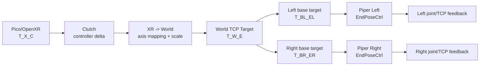

# Piper + Pico 数据采集中的坐标系、运动学与逆运动学

本文说明在使用 Pico、Isaac Teleop、Piper 单臂/双臂和 RL-100 进行真机数据采集时，如何处理坐标系转换、正向运动学（FK）和逆运动学（IK）。

本文暂不讨论相机内参、相机外参和点云标定，重点是：

```text
Pico 控制器位姿
  -> 机器人末端目标
  -> Piper 运动命令
  -> 机器人反馈和训练数据
```

## 1. 核心结论

第一阶段推荐采用：

```text
Pico/OpenXR controller pose
  -> Isaac Teleop 读取控制器数据
  -> 自定义 clutch 和坐标系映射
  -> workspace/速度/状态安全过滤
  -> Piper EndPoseCtrl
  -> Piper 控制器内部 IK 和轨迹执行
```

这条路线中：

- Isaac Teleop 负责获取 XR 位姿和基础 SE(3) retargeting。
- 自定义 Piper bridge 负责 XR、公共 world 和 Piper base 之间的转换。
- Piper Python SDK 负责发送 Cartesian 目标和读取反馈。
- Piper 固件负责把 Cartesian 目标转换为关节运动。
- 第一阶段不需要在主机上安装 MoveIt、Pinocchio 或自己实现 IK。

但必须保存原始 XR pose、转换后的 target、实际命令和机器人反馈，使未来切换到外部 IK 时不需要重新采集数据。

## 2. 坐标系与记号

### 2.1 建议定义的坐标系

| 符号 | 坐标系 | 说明 |
| --- | --- | --- |
| `X` | XR tracking frame | Pico/OpenXR 提供控制器位姿的参考系 |
| `W` | common world frame | 双臂公共工作台坐标系 |
| `B_L` | left base frame | 左 Piper 基座坐标系 |
| `B_R` | right base frame | 右 Piper 基座坐标系 |
| `C_L` | left controller frame | Pico 左控制器坐标系 |
| `C_R` | right controller frame | Pico 右控制器坐标系 |
| `E_L` | left TCP/EE frame | 左臂工具中心点/末端坐标系 |
| `E_R` | right TCP/EE frame | 右臂工具中心点/末端坐标系 |

即使第一版只做单臂，也建议保留公共 world 概念。单臂调试阶段可以临时定义：

```text
W = B_L
```

或者：

```text
W = B_R
```

### 2.2 变换矩阵记号

本文使用：

```text
T_A_B
```

表示把 `B` 坐标系中的点转换到 `A` 坐标系：

```text
p_A = T_A_B * p_B
```

齐次变换矩阵为：

```text
        [ R_A_B  t_A_B ]
T_A_B = [                ]
        [ 0 0 0     1    ]
```

其中：

- `R_A_B` 是 `3 x 3` 旋转矩阵。
- `t_A_B` 是 `3 x 1` 平移向量。
- 平移统一使用米。
- 内部旋转推荐使用 rotation matrix 或 quaternion `[x, y, z, w]`。
- 只在调用 Piper SDK 前转换为 Euler degree。

变换逆矩阵：

```text
inverse(T_A_B) = T_B_A
```

变换组合：

```text
T_A_C = T_A_B * T_B_C
```

## 3. 整体坐标链



双臂系统必须明确保存：

```text
T_W_BL
T_W_BR
```

它们表示左右 Piper 基座在公共 world 中的固定安装位姿。

## 4. Isaac Teleop 如何处理 XR pose

### 4.1 输入格式

Pico 通过 CloudXR/OpenXR 提供：

```text
left/right grip position
left/right grip orientation
left/right aim position
left/right aim orientation
trigger
squeeze
tracking valid/active
timestamp
```

位姿通常采用：

```text
position: [x, y, z], meter
orientation: [qx, qy, qz, qw]
```

### 4.2 `Se3AbsRetargeter`

实现位置：

```text
../IsaacTeleop/src/retargeters/se3_retargeter.py
```

绝对模式输出：

```text
[x, y, z, qx, qy, qz, qw]
```

主要操作：

- 选择 wrist/controller 或手指平均位姿。
- 应用固定位置偏置。
- 应用固定姿态偏置。
- 可选择只保留 yaw。
- 使用 SciPy `Rotation` 进行 quaternion/Euler/rotation matrix 转换。

绝对模式本身不会自动完成通用的 XR world 到任意机器人 base 的标定。上下游必须保证输入 pose 已在目标 frame 中，或者额外插入 frame transform。

### 4.3 `Se3RelRetargeter`

相对模式输出：

```text
[dx, dy, dz, drx, dry, drz]
```

旋转增量使用：

```python
relative_rotation = current_rotation * previous_rotation.inv()
delta_rotation = relative_rotation.as_rotvec()
```

并提供：

- `delta_pos_scale_factor`
- `delta_rot_scale_factor`
- `alpha_pos` 位置平滑
- `alpha_rot` 旋转平滑
- 平移和旋转死区

这仍然只是任务空间增量，不是 IK。

### 4.4 SO-101 clutch 实现

实现位置：

```text
../IsaacTeleop/src/retargeters/SO101/clutch_retargeter.py
```

核心位置公式：

```text
p_target = p_home + scale * (p_controller - p_controller_origin)
```

按下 clutch/进入 RUNNING 时：

- 记录 controller origin。
- 记录或恢复机器人 EE home。
- 第一帧满足 `p_controller == origin`，所以 target 不跳变。

重新 clutch 时：

- controller origin 重新记录。
- home 使用最后一次命令的末端位置。
- 操作者可以移动手柄到舒适位置后继续控制。

Piper 方案应采用相同原则，但 home 最好读取 Piper 当前 TCP feedback，而不是只使用上一次命令。

## 5. RL-100 原有遥操作代码

实现位置：

```text
tools/teleop_off2off_data/teleop.py
```

该代码使用 Vision Pro、xArm 和 Franka，坐标转换是项目手写的 NumPy/SciPy 实现。

### 5.1 初始化

开始遥操作时记录：

```text
robot_init_left/right
hand_init_left/right
```

### 5.2 计算 XR 相对运动

```text
R_delta = R_hand_now * transpose(R_hand_init)
t_delta = t_hand_now - t_hand_init
```

### 5.3 XR 到机器人轴映射

代码中使用：

```python
hand_transform_robot = (
    X_VR2Robot
    @ hand_transform_VR
    @ inverse(X_VR2Robot)
)
```

左手映射目前是 identity；右手映射硬编码为：

```text
diag(-1, -1, 1, 1)
```

### 5.4 叠加到机器人初始位姿

```text
R_robot_target = R_delta_robot * R_robot_init
t_robot_target = t_robot_init + t_delta_robot
```

然后调用：

```text
xArm set_servo_cartesian()
Franka servoL()
```

RL-100 这段 Python 没有显式实现 xArm/Franka IK；Cartesian target 到关节命令由对应机器人控制器或 vendor driver 处理。

### 5.5 对 Piper 的启示

可以复用：

- 初始 pose/re-clutch 的相对控制思想。
- 使用齐次矩阵表达位姿。
- 使用 SciPy Rotation 做姿态转换。
- 记录最终实际命令作为 action。

不应直接复用：

- 硬编码 `X_VR2Robot`。
- 左右臂简单镜像假设。
- xArm/Franka 的单位和 Euler 约定。
- 单相机采集结构。

## 6. Piper 推荐的 clutch 与坐标转换

### 6.1 clutch anchor

当对应控制器 squeeze 从未按下变成按下时，记录：

```text
T_X_C0        当前 controller anchor
T_W_E0        当前 Piper TCP feedback 转到 world 后的 anchor
```

控制期间获取：

```text
T_X_Ct
```

### 6.2 XR 相对变换

推荐完整 SE(3) 表达：

```text
Delta_T_X = inverse(T_X_C0) * T_X_Ct
```

也可以分别计算平移和旋转：

```text
delta_p_X = p_X_Ct - p_X_C0
delta_R_X = R_X_Ct * inverse(R_X_C0)
```

必须在实现中固定左乘/右乘约定，不能混合两套公式。

### 6.3 XR 到 world 轴映射

定义纯旋转：

```text
R_W_X
```

则：

```text
delta_p_W = translation_scale * R_W_X * delta_p_X
delta_R_W = R_W_X * delta_R_X * inverse(R_W_X)
```

平移和旋转应使用独立 scale：

```text
translation_scale
rotation_scale
```

旋转 scale 不应直接缩放 rotation matrix，而应转换成 rotvec 后缩放：

```text
r_W = log(delta_R_W)
r_W_scaled = rotation_scale * r_W
delta_R_W_scaled = exp(r_W_scaled)
```

SciPy 对应：

```python
rotvec = Rotation.from_matrix(delta_R_W).as_rotvec()
delta_R_W_scaled = Rotation.from_rotvec(scale * rotvec).as_matrix()
```

### 6.4 生成 world TCP target

若使用 world-frame 增量：

```text
p_W_E_target = p_W_E0 + delta_p_W
R_W_E_target = delta_R_W_scaled * R_W_E0
```

如果希望旋转增量在 tool/body frame 生效，乘法顺序会变成：

```text
R_W_E_target = R_W_E0 * delta_R_tool
```

两者手感不同，必须选择一种并写入数据 schema。第一版建议使用 world-frame 平移，姿态采用明确标定后的 controller 相对旋转。

### 6.5 world target 转 Piper base target

左臂：

```text
T_BL_EL_target = inverse(T_W_BL) * T_W_EL_target
```

右臂：

```text
T_BR_ER_target = inverse(T_W_BR) * T_W_ER_target
```

最后将每个 base-frame target 转换成 Piper SDK 的：

```text
X, Y, Z: 0.001 mm integer
RX, RY, RZ: 0.001 degree integer
```

内部不应提前转换为这些协议单位。

## 7. 正向运动学（FK）

### 7.1 FK 的定义

正向运动学根据关节位置求末端位姿：

```text
q -> T_base_ee
```

FK 常用于：

- 检查 joint feedback 与 TCP feedback 是否一致。
- 计算腕部相机的动态外参。
- 做 joint limit 和 workspace 检查。
- 计算 Jacobian 或准备外部 IK。
- 记录训练数据中的末端状态。

### 7.2 Piper SDK 的 FK

本地实现：

```text
../piper_sdk/piper_sdk/kinematics/piper_fk.py
```

接口：

```python
C_PiperForwardKinematics.CalFK(joints)
```

Piper interface 也提供：

```python
GetFK(mode="feedback")
GetFK(mode="control")
```

实现位置：

```text
../piper_sdk/piper_sdk/interface/piper_interface_v2.py
```

SDK 注释中的输出单位：

```text
XYZ: mm
RX/RY/RZ: degree
```

注意根据 Piper 固件版本正确设置：

```text
dh_is_offset
installation_pos
```

否则 FK frame 和真实安装姿态可能不一致。

### 7.3 采集时是否每帧计算 FK

建议：

- 原始层保存 joint feedback 和 Piper TCP feedback。
- 可以异步计算 SDK FK 用于在线检查。
- 不要因为 FK 计算失败而丢弃完整原始流。
- 离线处理时重新计算并比较 TCP feedback。

## 8. 逆运动学（IK）

### 8.1 IK 的定义

逆运动学根据目标末端位姿求关节配置：

```text
T_base_ee_target -> q_target
```

一个末端位姿可能：

- 有多组关节解。
- 无解。
- 接近奇异点。
- 需要选择最接近当前关节状态的解。
- 满足几何可达但不满足碰撞约束。

### 8.2 Isaac Teleop 的职责

Isaac Teleop 的通用 `Se3AbsRetargeter`、`Se3RelRetargeter` 和 SO-101 clutch 输出的是 EE pose 或 EE delta，本身不是通用机械臂 IK 求解器。

SO-101 真机流程是：

```text
XR controller
  -> clutch retargeter
  -> EE pose
  -> LeRobot kinematics/IK
  -> SO-101 joint command
```

本地 Isaac Teleop 文档说明 LeRobot 的 `kinematics` extra 提供 XR 路线 IK，并使用 SO-101 URDF/meshes。实际 solver 位于外部 LeRobot 仓库，不在当前本地 checkout 中。

### 8.3 Piper SDK 的职责

Piper Python SDK 提供：

```python
EndPoseCtrl(X, Y, Z, RX, RY, RZ)
JointCtrl(j1, j2, j3, j4, j5, j6)
```

本地 SDK 没有发现公开的 Python IK 接口。

使用：

```text
MotionCtrl_2(MOVE P)
EndPoseCtrl(...)
```

时，主机发送 Cartesian target，Piper 控制器/固件负责内部逆解和运动执行。因此系统仍然发生 IK，只是 IK 不在我们的 Python 进程里。

### 8.4 第一版为何选择固件 IK

优点：

- 不需要 Piper URDF 和 mesh。
- 不需要额外 IK 依赖。
- 与 RL-100 计划中的 Cartesian action 一致。
- 实现路径最短，适合单臂低速 bring-up。

限制：

- 内部求解过程不可见。
- 解选择、奇异点和轨迹细节可控性较弱。
- 不方便在执行前完成精确的双臂碰撞检查。
- 必须依赖 arm status、workspace 和 step limit 做外部保护。

## 9. 什么时候切换到主机侧 IK

出现以下问题时考虑主机侧 IK：

- `EndPoseCtrl` 高频遥操作明显不平滑。
- 姿态跟踪或解选择不稳定。
- 经常出现无解或奇异点状态。
- 需要约束关节速度、加速度和姿态权重。
- 需要双臂碰撞预测和协同约束。
- 希望 policy 输出 joint action 而不是 Cartesian action。

### 9.1 可选方案

| 方案 | 能力 | 适用情况 |
| --- | --- | --- |
| MoveIt 2 | IK、规划、碰撞检测 | 完整 ROS2 双臂系统 |
| Pinocchio | FK、Jacobian、动力学 | 自己实现实时 IK/优化 |
| Pink | 基于 Pinocchio 的任务空间 IK | 多任务和约束 IK |
| Damped Least Squares | 简单 Jacobian IK | 轻量实时原型 |
| TRAC-IK/KDL | 常见机械臂 IK | ROS/URDF 传统方案 |

### 9.2 Pinocchio 与 Isaac Teleop 依赖

Isaac Teleop 的完整 `retargeters` extra 包含 Pinocchio 相关依赖，主要用于 URDF FK 和复杂 retargeting；当前安装的是：

```text
retargeters-lite
```

它只有 SciPy，不提供 Piper IK。

如果未来引入主机侧 IK，建议在独立模块中实现，避免把 IK 逻辑写进 Isaac controller source。

## 10. 推荐软件分层

```text
isaac_controller_source.py
  输入：XR controller packet
  输出：原始 controller pose/buttons/valid/timestamp
  不理解 Piper，不做 IK

vr_mapper.py
  输入：controller pose + clutch state
  输出：world/base frame TCP target
  负责坐标系、scale、offset、quaternion

safety_filter.py
  输入：TCP target + robot state
  输出：允许执行的安全 target
  负责 workspace、step、velocity、timeout、双臂距离

piper_arm.py
  输入：SI 单位 target
  输出：SDK 命令和 robot feedback
  只在边界转换 Piper 协议单位

kinematics.py（可选）
  FK/Jacobian/IK
  第一版可只包装 Piper FK
  后续可替换为 Pinocchio/MoveIt

episode_recorder.py
  记录所有层的数据和时间戳
```

这种分层使得：

- Isaac Teleop 可替换为自研 Pico Bridge。
- Piper 固件 IK 可替换为外部 IK。
- 数据格式和坐标约定保持不变。

## 11. 数据采集时应保存的字段

### 11.1 XR 原始数据

```text
xr_tracking_frame_id
left/right controller grip pose
left/right controller aim pose
trigger/squeeze/buttons
tracking_valid/active
device_timestamp
host_receive_timestamp
```

### 11.2 坐标转换数据

```text
T_W_X or R_W_X
T_W_BL
T_W_BR
controller_anchor pose
TCP anchor pose
translation_scale
rotation_scale
orientation_offset
target pose in world frame
target pose in Piper base frame
```

### 11.3 命令数据

```text
unfiltered_target
safety_filtered_target
actual EndPoseCtrl command
actual GripperCtrl command
command timestamp
rejected/limited flag and reason
```

### 11.4 反馈数据

```text
joint feedback
TCP feedback
gripper feedback
arm status/error
SDK FK result
feedback timestamp
```

BC 的 action label 应使用最终实际下发的安全命令，不使用未经处理的 Pico pose。

## 12. Action 定义

### 12.1 单臂

推荐 7D：

```text
[dx, dy, dz, drx, dry, drz, gripper]
```

### 12.2 双臂

推荐 14D：

```text
[
  left_dx, left_dy, left_dz,
  left_drx, left_dry, left_drz,
  left_gripper,
  right_dx, right_dy, right_dz,
  right_drx, right_dry, right_drz,
  right_gripper
]
```

必须固定：

- delta 是相对当前反馈还是相对上一 target。
- delta 在 world frame、base frame 还是 tool frame。
- rotation 使用 rotvec 还是 Euler。
- gripper 是绝对目标还是增量。
- observation 与 action 的时间关系。

建议第一版：

```text
translation delta: common world frame
rotation delta: rotation vector, radian
gripper: normalized absolute target
action: safety-filtered command applied during [t, t+1)
```

## 13. 安全检查与运动学的关系

在使用固件 IK 时，主机仍应进行：

```text
tracking validity
command timeout
workspace bounds
per-step translation/rotation limits
target finite/NaN check
current joint limits
Piper arm status
TCP-to-TCP minimum distance
table/central exclusion zone
```

注意：

- workspace 检查不能替代 IK feasibility。
- joint limit 检查不能替代碰撞检查。
- Piper 返回无解、奇异点或碰撞状态时必须 hold/stop。
- 双臂共同区域在没有模型碰撞检查时应采用保守几何禁区。

## 14. 坐标系验证步骤

### 14.1 软件 dry-run

只打印，不发送 Piper 命令：

```text
controller pose
controller delta
world delta
left/right base target
Piper SDK integer command
```

检查单位和符号。

### 14.2 单臂逐轴验证

固定初始姿态，每次只允许：

```text
+X / -X: 1 mm
+Y / -Y: 1 mm
+Z / -Z: 1 mm
+RX / -RX: 0.5 degree
+RY / -RY: 0.5 degree
+RZ / -RZ: 0.5 degree
```

记录：

- 手柄实际移动方向。
- 计算出的 world/base target。
- 机械臂实际移动方向。
- Piper TCP feedback。

### 14.3 clutch 验证

```text
按下 squeeze -> target 等于当前 TCP，不跳变
移动手柄 -> TCP 连续移动
松开 squeeze -> target hold
移动手柄回舒适位置 -> 机械臂不动
重新按下 -> 新 anchor，无跳变
```

### 14.4 双臂验证

先把两臂限制在互不重叠的外侧 workspace：

- 左控制器只能驱动左臂。
- 右控制器只能驱动右臂。
- 左右 base 变换不交换。
- 同一 world 方向在两臂反馈中表现一致。
- 任一侧错误触发预定的单臂或双臂 hold。

## 15. 常见错误

### 矩阵乘法顺序错误

症状：平移方向正确但旋转后方向变化异常。

处理：统一 `T_A_B` 约定，为每个变换写 frame 名，不使用含糊的 `transform` 变量。

### quaternion 顺序错误

Isaac Teleop/SciPy 使用：

```text
[x, y, z, w]
```

其他库可能使用 `[w, x, y, z]`。所有接口边界必须显式转换。

### meter/mm 混用

内部统一 meter；Piper SDK 在发送边界转换为 `0.001 mm` integer。

### radian/degree 混用

内部统一 radian；Piper SDK 在发送边界转换为 `0.001 degree` integer。

### 左右臂简单镜像

左右 Piper 的 base 安装方向应由 `T_W_BL`、`T_W_BR` 表达，不通过临时取负号实现。

### Euler 跳变

内部保存 quaternion；发送 Piper 前选择与上一命令连续的 Euler 表示，避免 `+180/-180` 跳变。

### 把测量动作当成命令动作

BC action 应是实际命令。测量 TCP delta 单独保存，用于跟踪误差分析。

## 16. 分阶段实施建议

```text
阶段 1：Pico controller pose dry-run
阶段 2：单臂 1 mm/0.5 degree 坐标验证
阶段 3：Pico clutch + Piper EndPoseCtrl
阶段 4：单臂 Pick-and-Place 数据
阶段 5：双臂隔离 workspace
阶段 6：双臂协同 Pick-and-Place
阶段 7：评估是否需要主机侧 IK
```

只有当 Piper 固件 Cartesian 控制不能满足连续性、安全约束或双臂协调要求时，才进入 MoveIt/Pinocchio/Pink 路线。

## 17. 最终推荐

当前 Piper 数据采集系统采用：

```text
坐标转换：项目自行实现，NumPy + SciPy Rotation
Clutch：参考 Isaac Teleop SO-101 clutch，自行适配 Piper feedback
FK：Piper SDK FK + TCP feedback 交叉验证
IK：第一版使用 Piper 固件内部 IK
命令接口：MOVE P + EndPoseCtrl
训练 action：最终 safety-filtered Cartesian command
```

同时保持模块边界，使未来可以将：

```text
Piper 固件 IK
```

替换为：

```text
URDF + Pinocchio/Pink/MoveIt IK + JointCtrl
```

而不改变 Pico 输入、数据 schema 和 RL-100 训练接口。
