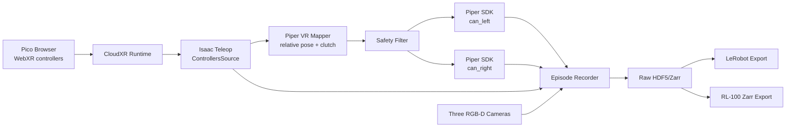

# Piper + Pico + Isaac Teleop 真机直控与数据采集执行计划

本文基于以下本地仓库和当前主机环境进行分析：

```text
../IsaacTeleop    NVIDIA Isaac Teleop 1.4.x
../piper_sdk      Piper SDK 0.6.1
./                RL-100
```

目标是使用 Pico 左右控制器遥操作 Piper 单臂或双臂，直接采集真实机器人 Pick-and-Place 数据，不把 Isaac Sim 或 Isaac Lab 作为前置条件。

## 1. 可行性结论

**技术上可行，但不是开箱即用。**

本地 Isaac Teleop 已经提供：

- Pico/Quest 通过浏览器连接的 CloudXR Web Client。
- 左右控制器 pose、trigger、squeeze、按键和 tracking-valid 状态。
- 相对/绝对 SE(3) retargeting 示例。
- ROS2 topic 发布参考。
- 无仿真的真机 SO-101 控制和 LeRobot 数据采集方案。
- aarch64 构建和 `retargeters-lite` 路径。

本地 Piper SDK 已经提供：

- `can_left`、`can_right` 两个独立接口控制双臂。
- 关节角、末端 pose、夹爪、状态和错误反馈。
- `EndPoseCtrl()` Cartesian 绝对末端目标控制。
- `JointCtrl()` 关节位置控制。
- `GripperCtrl()` 夹爪控制。
- `EmergencyStop()` 和 SDK 关节/夹爪限位。

缺失的是：

- Isaac Teleop 没有 Piper embodiment/robot adapter。
- 现成 LeRobot 真机示例只支持 SO-101，且脚本位于 LeRobot 仓库，不在当前 checkout 中。
- 没有 Pico pose 到 Piper 坐标系和动作单位的映射。
- 没有双臂碰撞、工作空间、超时和 tracking-loss 安全层。
- 没有三路 RGB-D、Piper 状态和动作的统一记录器。
- 当前主机还没有安装 `isaacteleop` 和 `rclpy`。

因此推荐实现一个很薄但边界清晰的 Piper bridge，而不是修改 Isaac Teleop 核心。

## 2. 本地证据

### 2.1 Pico 是明确支持设备

本地文档：

```text
../IsaacTeleop/docs/source/overview/ecosystem.rst
../IsaacTeleop/docs/source/getting_started/quick_start.rst
../IsaacTeleop/docs/source/getting_started/lerobot/devices.rst
```

其中明确列出：

```text
Pico 4 Ultra
motion controllers
hand tracking
Isaac Teleop Web Client
Pico OS 15.4.4U or newer
```

连接方式是：

1. 工作站启动 CloudXR runtime。
2. Pico 浏览器打开 Isaac Teleop Web Client。
3. 输入工作站 IP，接受自签名证书并连接。
4. Isaac Teleop 从 OpenXR/CloudXR 读取控制器数据。

如果实际设备不是 Pico 4 Ultra，不能仅凭“Pico”品牌断言完全兼容。需要先执行第 6 节的 XR smoke test。

### 2.2 真机采集不要求 Isaac Sim

本地文档：

```text
../IsaacTeleop/docs/source/getting_started/lerobot/data_collection_real.rst
```

该流程使用 XR controller 直接控制真实 SO-101 并写入 LeRobot dataset。Isaac Sim 只出现在另一份 `data_collection_sim.rst` 中。因此设备输入、真机控制和数据记录可以脱离仿真运行。

### 2.3 控制器数据满足双臂遥操作

ROS2 reference 能发布：

```text
xr_teleop/ee_pose
xr_teleop/controller_data
xr_teleop/head_pose
/tf
```

`controller_data` 包含：

```text
left/right aim position
left/right aim orientation
left/right grip position
left/right grip orientation
left/right trigger value
left/right squeeze value
buttons and thumbsticks
left/right active flags
timestamp
```

相关实现：

```text
../IsaacTeleop/examples/teleop_ros2/python/messages.py
../IsaacTeleop/examples/teleop_ros2/python/session_config.py
```

这已经足以实现：

```text
squeeze -> clutch/deadman
controller relative pose -> Piper TCP target
trigger -> Piper gripper position
active flag -> tracking-loss stop
```

### 2.4 Piper 可直接接收 Cartesian 目标

Piper SDK 0.6.1 提供：

```python
arm.MotionCtrl_2(0x01, 0x00, speed_percent, 0x00)
arm.EndPoseCtrl(X, Y, Z, RX, RY, RZ)
arm.GripperCtrl(gripper_angle, effort, 0x01, 0)
```

协议单位：

```text
X/Y/Z: 0.001 mm
RX/RY/RZ: 0.001 degree
gripper_angle: 0.001 mm
```

末端反馈可通过 `GetArmEndPoseMsgs()` 获得，关节和夹爪反馈分别通过 `GetArmJointMsgs()`、`GetArmGripperMsgs()` 获得。

这意味着第一版可以使用 Piper 内部 Cartesian 控制，不必先提供 Piper URDF 和外部 IK。后续如果 Cartesian 控制的跟踪、奇异位姿处理或双臂碰撞约束不足，再接 MoveIt/Pinocchio/Isaac Sim。

## 3. 当前主机约束

检查结果：

```text
Hardware: NVIDIA Jetson AGX Thor Developer Kit
Architecture: aarch64
OS: Ubuntu 24.04.4
Python: 3.12.12
CUDA: 13.0
L4T: R38.2.2
isaacteleop: not installed
rclpy: not installed
CAN interfaces: can0, can1, can2, can3 currently visible
```

Isaac Teleop 文档存在一处需要实测解决的差异：

- requirements 页仍把 robot teleop 主机写成 x86_64、CUDA 12.8+。
- Quick Start 已提供 aarch64/DGX Spark 的安装步骤。
- CloudXR 下载脚本、CMake、Televiz 和 ROS2 Dockerfile 都包含 arm64 分支。
- LeRobot 真机文档说明 `retargeters-lite` 同时支持 x86_64 和 aarch64。

因此 AGX Thor **不是已确认失败**，但也不能只凭文档宣称完整支持。必须先完成 CloudXR + Pico controller smoke test，再连接机械臂。

`nvidia-smi` 在当前 Thor 上失败不能单独作为 GPU 不可用的判断；CUDA 13.0 和 L4T 已安装。但 CloudXR runtime 是否支持该 Thor/L4T 组合仍需实际启动验证。

## 4. 推荐架构

第一版不使用 ROS2，也不启动 Isaac Sim：



选择直接 Python 而不是 ROS2 的原因：

- `rclpy` 当前没有安装。
- Piper SDK 本身就是 Python API。
- 首版只有一个主机进程，ROS2 不是必要条件。
- 少一层 topic serialization 和时间戳转换。
- 可以直接复用 Isaac Teleop 的 `ControllersSource` 和 `TeleopSession`。

当相机、机器人服务需要跨主机部署时，再将同一接口拆成 ROS2 nodes。

## 5. 控制设计

### 5.1 使用原始 controller pose

第一版建议读取左右 controller 原始数据，自行实现 clutch。不要直接把 XR absolute pose 当成 Piper world pose。

每次 squeeze 从未按下变成按下时，对该侧记录：

```text
T_xr_controller_anchor
T_world_tcp_anchor
```

按住 squeeze 时：

```text
Delta_T_xr = inverse(T_xr_controller_anchor) * T_xr_controller_now
Delta_T_world = axis_map_and_scale(Delta_T_xr)
T_world_tcp_target = T_world_tcp_anchor * Delta_T_world
```

松开 squeeze：

- 停止更新 target。
- 继续发送最后一个安全 target 或进入 Piper hold/standby 策略。
- 下一次按下时重新 anchor，避免手柄回位造成机械臂跳变。

### 5.2 推荐按键

| Pico 输入 | Piper 行为 |
| --- | --- |
| 左 squeeze | 左臂 clutch/deadman |
| 右 squeeze | 右臂 clutch/deadman |
| 左 trigger | 左夹爪连续开合 |
| 右 trigger | 右夹爪连续开合 |
| controller tracking invalid | 对应臂立即 hold |
| 主机键盘 `n` | 保存并结束当前 episode |
| 主机键盘 `r` | 作废并重新采集 |
| 主机键盘 `q` | 安全结束采集 |
| 独立物理急停 | 双臂硬件急停 |

不要把软件按键当作唯一急停。

### 5.3 坐标和动作单位

内部统一使用：

```text
position: meter
rotation: quaternion xyzw / rotation vector radian
gripper: meter or normalized [-1, 1]
```

只在 `PiperArm.send_target()` 最后一层转换为 SDK 协议单位。

需要标定的不是 XR 的绝对原点，而是轴方向：

```text
Pico controller +x/+y/+z
  -> common world +x/+y/+z
  -> left/right Piper base frame
```

左右臂都应先逐轴验证，不允许通过简单复制加符号猜测镜像关系。

### 5.4 Piper 控制模式

首选：

```text
MOVE P + EndPoseCtrl
20 Hz target update
10%-20% speed during bring-up
```

原因：

- 不需要外部 IK。
- action 和 RL-100 推荐的 Cartesian action 一致。
- 可以直接记录安全过滤后的 TCP delta 作为 7D/14D action。

备选：外部 IK 后使用 `JointCtrl`。只在 MOVE P 实测不能满足连续性或姿态控制时切换。

双臂应作为两个独立 CAN-command follower 控制：

```text
C_PiperInterface_V2("can_left")
C_PiperInterface_V2("can_right")
```

不要把它们配置成 Piper SDK 文档中的硬件 master/slave 跟随模式；该模式会让 master arm 持续发送控制帧并与软件命令冲突。

## 6. 分阶段执行计划

每个阶段都有明确 gate。前一阶段没有通过，不进入下一阶段。

### 阶段 A：确认 Pico 和 CloudXR

目标：不连接 Piper，只证明当前 AGX Thor 能收到 Pico 控制器数据。

1. 确认 Pico 型号和系统版本。
2. 创建独立环境，不改 RL-100 训练环境。
3. 选择一个 Isaac Teleop 版本路径：
   - 快速验证使用文档验证过的 pip `1.3.131 + retargeters-lite`。
   - 若使用当前 1.4.x checkout，则完整按 source build 文档构建。
4. 不混用 1.3 pip wheel 和 1.4 checkout Python 模块。
5. 接受 CloudXR EULA并启动 runtime。
6. Pico 浏览器打开 Web Client 并连接 Thor IP。
7. 运行 gripper 和 controller SE3 示例。

建议的快速验证安装思路：

```bash
python3.12 -m venv ~/venvs/piper_isaac_teleop
source ~/venvs/piper_isaac_teleop/bin/activate

python -m pip install -U pip
python -m pip install \
  "isaacteleop[cloudxr,retargeters-lite]~=1.3.131" \
  "scipy>=1.14" msgpack msgpack-numpy h5py zarr
```

实际安装前应先确认 NVIDIA package index 和 ARM wheel 是否可解析；若 pip 路径失败，再按本地 checkout 的 aarch64 source build 流程处理。

启动：

```bash
python -m isaacteleop.cloudxr --accept-eula --host-client
```

Pico 浏览器打开：

```text
https://<thor-ip>:48322/client/
```

Gate A：

```text
CloudXR 连续运行 10 分钟
左右 controller position/orientation 连续更新
trigger 和 squeeze 范围正确
左右 active flag 正确
遮挡或断开后 invalid 能在 100 ms 量级被程序观察到
```

### 阶段 B：Piper SDK 只读

目标：不发送运动命令，读取双臂状态。

1. 根据 USB 物理端口固定命名 `can_left`、`can_right`。
2. 波特率固定为 1,000,000。
3. 分别创建两个 `C_PiperInterface_V2`。
4. 读取关节、末端、夹爪、arm status 和 FPS。
5. 记录 30 分钟，检查时间戳、FPS 和错误状态。

Gate B：

```text
左右 CAN 不串号
反馈 Hz 非零且稳定
关节/末端/夹爪单位转换正确
断开任意一侧 CAN 能被 watchdog 检出
```

### 阶段 C：Piper 单臂小步运动

目标：证明安全控制 wrapper，不接 Pico。

1. 先启用一条机械臂。
2. 从当前反馈 pose 生成 1-2 mm 的单轴目标。
3. 依次验证 world/base 的 X/Y/Z。
4. 验证不超过 1 度的 RX/RY/RZ。
5. 验证夹爪最小范围动作。
6. 测试通信超时 hold 和 `EmergencyStop(0x01)`。

注意：不要把 `ResetPiper()` 当作普通停止。SDK 注释明确说明 reset 会让机械臂立即失电下落。

Gate C：

```text
六轴方向符合预期
命令和反馈单位一致
超限 target 被软件拒绝
程序异常和 Ctrl+C 后不继续发送新目标
物理急停可用
```

### 阶段 D：Pico 控制单臂

目标：连接 Isaac Teleop 和 Piper，但先不采正式数据。

实现：

```text
ControllersSource
  -> tracking validator
  -> squeeze edge detector / clutch
  -> relative SE3 mapper
  -> workspace and velocity limiter
  -> PiperArm.send_cartesian_target()
```

bring-up 顺序：

1. 只映射位置，不映射旋转和夹爪。
2. 平移比例设为 0.25-0.5。
3. 开启旋转，限制每周期 1-2 度。
4. 开启 trigger 到夹爪的连续映射。
5. 提升到 20 Hz target update。

Gate D：

```text
clutch 松开时机械臂不动
重新 clutch 时没有位置跳变
Pico tracking 丢失时立即 hold
动作平滑，无明显抖动或累积漂移
连续运行 20 个短 episode 无错误
```

### 阶段 E：扩展到双臂

目标：左右控制器分别控制左右 Piper。

新增安全约束：

```text
left/right independent workspace
shared central exclusion zone
minimum TCP-to-TCP distance
maximum relative speed
one-arm fault -> both arms hold
one-controller invalid -> corresponding arm hold; cooperative task可配置 both hold
```

首个双臂测试不是抓取物体，而是两臂在各自外侧工作空间做小幅移动。确认左右映射后再进入共同工作区。

Gate E：

```text
左右控制器和左右臂无交换
两臂单独 clutch 和同时 clutch 均正确
任一侧故障触发预定的双臂停止策略
中央禁入区有效
```

### 阶段 F：三相机和记录器

目标：采集可回放的原始 episode，不先追求 RL-100 格式。

记录：

```text
Pico controller raw pose/buttons/valid/timestamp
Piper joint/tcp/gripper/status feedback
unfiltered target
safety-filtered target
actual SDK command
left wrist RGB-D
right wrist RGB-D
global RGB-D
camera/device/host timestamps
episode metadata and result
```

Isaac Teleop 的 MCAP 可以保存 XR 输入，但它不能替代完整机器人数据集。第一版推荐统一写 raw HDF5；也可并行保存 Isaac MCAP 作为 XR 调试副本。

Gate F：

```text
三相机、Pico 和机器人状态均可按时间回放
不存在左右相机/CAN 串号
obs[t] 对应 [t,t+1) 实际下发 action
异常退出只留下 .partial，不污染有效 episode
```

### 阶段 G：正式 Pick-and-Place 数据

按已有数据方案执行：

```text
docs/Piper双臂抓放数据采集方案.md
```

顺序：

```text
5-10 条固定场景 smoke
30-50 条 pilot BC
每臂 100-200 条单臂 BC
150-300 条双臂 BC
追加失败/恢复/策略 rollout 用于 offline RL
```

raw 数据分别导出：

```text
raw -> LeRobot dataset
raw -> RL-100 Zarr
```

## 7. 需要实现的文件

建议全部放在 RL-100 workspace，不修改 sibling 仓库：

```text
tools/piper_isaac_teleop/
  config.py
  isaac_controller_source.py
  piper_arm.py
  dual_arm_controller.py
  vr_mapper.py
  safety_filter.py
  camera_manager.py
  episode_recorder.py
  teleoperate.py
  record.py
  configs/pick_place.yaml

tools/piper_data/
  validate_raw.py
  export_lerobot.py
  export_rl100_zarr.py
```

### 7.1 `isaac_controller_source.py`

职责：

- 启动/连接 `TeleopSession`。
- 输出左右 controller pose、trigger、squeeze、active 和时间戳。
- 不包含 Piper 语义。
- 提供 synthetic/replay 输入，便于无头显测试。

### 7.2 `piper_arm.py`

职责：

- 封装单个 `C_PiperInterface_V2`。
- SDK 单位与 SI 单位转换。
- 状态快照、连接状态和错误检查。
- `send_cartesian_target()`、`send_gripper()`、`hold()`、`emergency_stop()`。
- 默认开启 SDK joint/gripper limit。

### 7.3 `vr_mapper.py`

职责：

- clutch edge 和 anchor。
- Pico/OpenXR 到公共 world 的坐标映射。
- 平移/旋转比例。
- quaternion 连续化和 Euler 输出转换。
- 输出 SI 单位绝对 TCP target 和 RL action delta。

### 7.4 `safety_filter.py`

职责：

- 每周期最大平移和旋转。
- 每秒速度限制。
- 单臂 workspace。
- 双臂中央禁区和 TCP 距离。
- tracking/CAN 超时。
- arm status 非 normal 拒绝命令。
- 记录被拒绝原因。

### 7.5 `episode_recorder.py`

职责：

- 高频原始流独立时间戳。
- episode 原子写入。
- success/failure/invalid metadata。
- 记录实际命令而不是只记录 Pico 输入。
- 保存 schema、标定和软件版本。

## 8. 数据格式选择

Isaac Teleop 的真机 SO-101 示例直接写 LeRobot 数据集，但 Piper 三路 RGB-D + RL-100 路线不应只保留 LeRobot 对齐帧。

推荐：

```text
Layer 0: raw HDF5/Zarr
  asynchronous Pico/Piper/camera streams
  full depth and calibration

Layer 1: LeRobot
  aligned RGB/state/action episodes
  ecosystem interoperability

Layer 2: RL-100 Zarr
  fused point_cloud
  state/action/next_*
  reward/return/done/timeout
```

Isaac Teleop `camera_viz` 可用于把相机画面显示到 Pico，但它不是三路 RGB-D 训练数据记录器。显示链路和训练数据记录链路应共享相机 source，但分别消费数据。

## 9. 首版配置建议

```yaml
teleop:
  input: pico_controller
  control_hz: 20
  translation_scale: 0.4
  rotation_scale: 0.5
  clutch_threshold: 0.6

robot:
  left_can: can_left
  right_can: can_right
  speed_percent: 15
  sdk_joint_limit: true
  sdk_gripper_limit: true
  gripper_min_m: 0.0
  gripper_max_m: 0.07

safety:
  max_translation_step_m: 0.005
  max_rotation_step_rad: 0.035
  command_timeout_s: 0.1
  min_tcp_distance_m: 0.15
  stop_both_on_arm_fault: true

recording:
  transition_hz: 10
  save_raw_rgbd: true
  save_xr_mcap: true
  output_dir: data/piper_pick_place/raw
```

这些值只用于低速 bring-up，必须在机械臂实际布局、夹爪和相机安装完成后重新确定 workspace 和双臂距离。

## 10. 风险和决策点

| 风险 | 当前判断 | 处理方式 |
| --- | --- | --- |
| Pico 型号/OS 不满足 WebXR | 未知 | Gate A 先验证 |
| CloudXR 在 AGX Thor 不兼容 | 未确认 | 先跑 controller-only；必要时换 x86 RTX 工作站 |
| Isaac 1.4 checkout 与 pip 1.3 wheel 混用 | 高风险 | 一个环境只选一个版本路径 |
| Piper MOVE P 高频跟踪不平滑 | 需实测 | 降频/插值，必要时外部 IK + JointCtrl |
| Euler 姿态跳变 | 可控 | 内部 quaternion，发送前连续化 Euler |
| 双臂互碰 | 高风险 | 首版隔离 workspace，之后引入模型碰撞检测 |
| 三相机带宽和同步 | 高风险 | 独立线程、设备时间戳、先测 30 分钟 |
| LeRobot 缺少 depth/offline-RL 字段 | 确定存在 | 保留 raw，单独导出 RL-100 Zarr |

如果 Gate A 在 Thor 上失败，最小替代方案不是放弃 Pico，而是把 CloudXR/Isaac Teleop 放到 x86_64 RTX 工作站，控制器数据通过 Ethernet 发送给 Thor；Thor 继续直连 CAN 和三台相机。这样机器人安全控制仍在本机，XR runtime 与机器人驱动解耦。

## 11. 最终建议

推荐采用以下主线：

```text
Pico 4 Ultra WebXR
  -> Isaac Teleop CloudXR controller input
  -> custom direct Python Piper bridge
  -> Piper MOVE P / EndPoseCtrl
  -> raw three-camera real-robot dataset
  -> LeRobot + RL-100 dual export
```

不把 Isaac Sim 加入第一阶段。等单臂 BC 数据链路跑通后，再为 Piper 建立 URDF/USD 数字孪生，用于双臂碰撞预测、仿真数据扩充和真机命令预检查。
