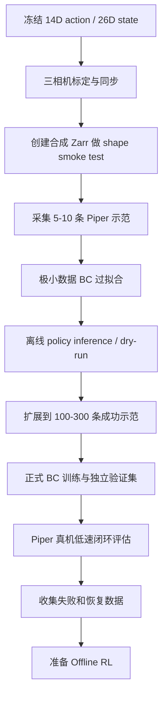

# Piper 双臂 BC 复现与迁移的下一步建议

## 1. 问题与结论

问题：

> 首先关注 BC 的迁移和复现，是否应该先跑通 RL-100 的 Flipping 任务？

结论：

```text
不应把“原始 Flipping 完整跑通”作为 Piper BC 迁移的前置条件。
```

更合适的目标是：

```text
参考 Flipping 的双臂数据与环境接口
  -> 为 Piper 定义稳定的数据契约
  -> 采集少量 Piper 遥操作数据
  -> 跑通真正的 BC-only
  -> 离线验证
  -> Piper 真机低速闭环评估
```

Flipping 的价值是“双臂代码模板”，不是可直接复现的公开基准。

## 2. 为什么不先完整复现 Flipping

### 2.1 缺少原始数据

配置引用：

```text
data/data_flipping_1210_50_0.01_0.05_False_False.zarr
```

在线脚本还引用：

```text
data/data_flipping_0103_122_0.01_0.05_True_True_0109_700.zarr
```

仓库和当前本地数据目录中没有这些数据集。因此无法仅靠仓库重现作者的 Flipping BC 指标。

### 2.2 原始环境绑定作者硬件

Flipping 真机路径包含：

- 作者的双臂 ZMQ robot server。
- RealSense 相机接口。
- Gello/遥操作设备。
- 写死的 IP、端口和本地数据路径。
- xArm/Franka 旧硬件语义。
- 人工键盘成功/失败标记。
- 特定的 reset 和初始轨迹。

即使模型训练代码可运行，也无法在 Piper 上直接调用原始 `FlippingEnv`。

### 2.3 配置存在遗留问题

已发现：

- `agent_pos` 配置与环境内部状态维度不完全一致。
- `critic_dataset`、`scale_dataset` 指向 `push_t.zarr`。
- reward 和 reset 不是通用实现。
- 真机 online 配置包含特定 checkpoint 时间戳。

在 Piper 迁移前投入时间恢复作者整套 Flipping 系统，收益低于直接建立 Piper BC 最小闭环。

## 3. Flipping 中值得复用的部分

关键文件：

```text
RL-100/rl_100/config/task/flipping.yaml
RL-100/rl_100/dataset/flipping_dataset.py
RL-100/rl_100/env/flipping/flipping_env.py
RL-100/rl_100/env_runner/flipping_runner.py
```

建议复用其结构思想：

| Flipping 内容 | Piper 中的用途 |
|---|---|
| 14D action | 双臂 TCP delta + 双夹爪 |
| 双臂 state 拼接 | Piper 左右臂状态组织 |
| 点云 + agent state | DP3 observation |
| Zarr dataset 类 | Piper dataset 模板 |
| `env.reset()/step()` | Piper 真机环境接口 |
| runner | 真机 episode、日志和评估 |
| ZMQ/远程控制思路 | 可选的 Piper robot server 架构 |

不建议直接复用：

```text
硬编码 IP/路径
作者的机器人 client
人工 reward
原始 reset
原始 action scale
原始相机标定
原始 checkpoint
```

## 4. 当前已经具备的 BC 基线

Adroit Door 已经验证：

- Zarr 数据读取。
- PointNet/DP3 点云编码。
- Diffusion Policy 前向和反向传播。
- BC optimizer 和学习率调度。
- checkpoint 保存。
- WandB 日志。
- 仿真 point cloud rollout。

因此无需用 Flipping 再证明“RL-100 能训练 Diffusion BC”。Piper 阶段真正需要验证的是：

```text
Piper 数据定义是否正确
Piper 三相机观测是否稳定
Piper 14D action 是否能被准确学习和执行
离线和在线预处理是否完全一致
```

## 5. 推荐的 Piper BC 最小任务

第一任务不建议选择翻转或开门。推荐：

```text
双臂共同抓取一个大物体
  -> 同步抬起
  -> 移动到目标区域
  -> 放下
```

它可以同时验证：

- 双臂同步。
- 双二指夹爪控制。
- 顶部相机全局定位。
- 两个腕部相机的近场抓取信息。
- 14D action 顺序与尺度。
- 双臂碰撞限制。
- 遥操作数据质量。

后续任务递进：

```text
共同搬运
  -> 一臂夹持、一臂调整
  -> 双臂翻转
  -> 双臂换手
  -> 装配/插接
  -> 开门
```

## 6. 在采集前冻结 observation/action contract

### 6.1 推荐 action：14D

```text
action = [
  left_dx, left_dy, left_dz,
  left_drx, left_dry, left_drz,
  left_gripper,
  right_dx, right_dy, right_dz,
  right_drx, right_dry, right_drz,
  right_gripper
]
```

建议：

- 平移单位为米。
- 旋转使用 rotvec/axis-angle 增量，单位弧度。
- 在双臂公共 world/base frame 表示。
- 夹爪归一化到统一范围，例如 `[-1, 1]`。
- policy 初始频率采用 10 Hz。
- 底层控制以 50-100 Hz 插值和限速。

### 6.2 推荐 robot state：26D

```text
左臂关节角 6
+ 右臂关节角 6
+ 双夹爪状态 2
+ 左右末端位姿 12
= 26
```

末端位姿每臂使用：

```text
x, y, z, rx, ry, rz
```

### 6.3 推荐视觉输入

第一版：

```text
左腕 RGB-D
+ 右腕 RGB-D
+ 顶部全局 RGB-D
  -> 转到公共 world frame
  -> 工作空间裁剪
  -> 桌面和机器人自体过滤
  -> 融合与去重
  -> 采样为 1024 × 3
```

如果相机只有 RGB、没有深度，则不能直接沿用当前 3D 点云策略。应增加 RGB-D、可靠双目深度，或改造为多视角 RGB policy。

## 7. 真正的 BC-only 模式

当前 RL-100 的：

```text
only_bc=True
```

并不会在 BC 后退出。只要 `offline=True`，程序还会继续：

```text
Critic
Dynamics
Offline BPPO
```

Piper bring-up 阶段建议增加真正的配置：

```yaml
training:
  bc_only: true
  enable_rollout: false
```

预期控制流：

```python
train_diffusion_bc()
save_bc_checkpoint()

if cfg.training.bc_only:
    return
```

同时，`enable_rollout=false` 时应避免实例化真机 runner。否则即使只想离线训练，也可能连接 Piper、相机或 ZMQ server。

建议拆分三个明确模式：

```text
bc_train_only
bc_real_eval_only
offline_rl_train
```

不要依赖多个布尔变量的隐式组合。

## 8. 推荐新增的 Piper 代码

```text
RL-100/rl_100/config/task/
  piper_dual_arm_lift.yaml

RL-100/rl_100/dataset/
  piper_dual_arm_dataset.py

RL-100/rl_100/env/piper/
  piper_dual_arm_env.py
  piper_client.py
  camera_manager.py
  pointcloud_fusion.py
  safety.py

RL-100/rl_100/env_runner/
  piper_dual_arm_runner.py

tools/teleop_off2off_data/
  piper_dual_arm_teleop.py
  piper_raw_to_zarr.py
  validate_piper_zarr.py
```

不要直接在 `FlippingEnv` 中添加 Piper 分支。独立模块更容易测试、回滚和维护。

## 9. Zarr 最小数据协议

训练 zarr 建议至少包含：

```text
data/state
data/next_state
data/action
data/next_action
data/point_cloud
data/next_point_cloud
data/reward
data/return
data/done
data/timeout
meta/episode_ends
```

BC 最少依赖：

```text
state
action
point_cloud
episode_ends
```

但为了后续 Offline RL，不应等 BC 完成后再补 transition。第一次采集就应同步保存 `next_*`、reward、done 和 timeout。

原始数据还应保留：

```text
三路 RGB/depth
相机内参
顶部相机固定外参
腕部相机 hand-eye 外参
每帧机器人 FK
机器人状态与相机时间戳
安全裁剪前后的 action
人工接管标记
```

## 10. 分阶段复现计划



### 10.1 阶段 0：数据 shape smoke test

先生成极小合成数据，只验证：

```text
point_cloud: N × 1024 × 3
state: N × 26
action: N × 14
episode_ends 合法
normalizer 可创建
DataLoader 可取 batch
policy forward/backward 可执行
```

这一步不验证策略能力，只验证迁移代码没有 shape 和字段错误。

### 10.2 阶段 1：5-10 条轨迹过拟合

验收目标：

- train loss 显著下降。
- 策略能复现训练集动作。
- 输出无 NaN/Inf。
- 左右臂没有交换。
- 夹爪符号没有反转。
- action 反归一化正确。
- 相同观测重复推理的动作分布合理。

如果极小数据都无法过拟合，不应继续采集数百条示范。

### 10.3 阶段 2：正式 BC 数据

可将以下数量作为起点，而非固定要求：

```text
100-300 条成功示范
10%-20% 独立场景验证集
多种物体初始位姿
多种双臂起始姿态
适量人工纠错和恢复轨迹
```

BC 主训练可以只使用成功/高质量示范；失败和部分成功数据应保留，为 Critic 和 Offline RL 使用。

### 10.4 阶段 3：真机 BC 评估

第一轮真机执行：

```text
env_num = 1
n_action_steps = 1
低速
小 TCP delta
无随机探索
操作员保持急停
只执行已验证工作空间
```

先做 shadow/dry-run：记录策略动作但不发送。确认动作合理后，再发送经过 safety filter 的动作。

## 11. BC 阶段的关键验收指标

### 11.1 离线指标

- Diffusion/denoising loss。
- action MSE，仅作为辅助指标。
- 每个 action 维度的误差，不只看总均值。
- 左右夹爪分类/连续误差。
- 不同场景的验证集误差。
- 点云和 state normalizer 范围。

### 11.2 真机指标

- 任务成功率。
- 人工接管率。
- 碰撞/越界触发率。
- 单 episode 时间。
- 动作平滑度。
- 双臂最小距离。
- 推理延迟和控制周期抖动。
- 三相机丢帧与时间同步误差。

### 11.3 分布一致性

必须对比训练与在线：

```text
point cloud 坐标范围
点云密度
机器人 state 范围
action 范围
相机外参
裁剪边界
normalization
```

BC 离线 loss 正常但真机失败，最常见原因之一就是预处理或坐标系不一致。

## 12. 采集时必须为 Offline RL 留接口

虽然第一阶段只做 BC，但数据系统应从第一天支持：

- transition 的 `next_obs`。
- 自动或可重算 reward。
- success/failure。
- done 与 timeout 分离。
- 人工接管标记。
- 实际执行动作。
- 原始任务测量量。

这样后续才能训练：

```text
IQL Q/V Critic
latent Dynamics
Offline BPPO
```

如果只保存成功示范的 observation/action，BC 可以训练，但 Offline RL 很难判断行为质量差异。

## 13. 近期建议执行顺序

按优先级：

1. 确认三台相机是否全部具有可靠深度。
2. 确认 Piper 双臂公共坐标系和左右臂基座变换。
3. 冻结 14D action 和 26D state 的顺序、单位与归一化。
4. 增加真正的 BC-only/disable-rollout 模式。
5. 建立 `PiperDualArmDataset` 和 yaml。
6. 用合成 zarr 做 shape smoke test。
7. 完成双臂遥操作与原始数据记录。
8. 用 5-10 条真实轨迹过拟合。
9. 做动作 dry-run 和低速真机评估。
10. 扩展正式数据集。

## 14. 最终建议

Flipping 应作为 Piper 双臂 BC 的接口设计参考，而不是必须先完整复现的任务。当前最短路径不是恢复作者的双臂硬件和私有数据，而是：

```text
Adroit 验证通用 BC 框架
+ Flipping 提供双臂结构参考
+ Piper 自己的数据和环境
= Piper BC 最小闭环
```

先将 BC-only、数据契约和真机安全评估做稳，再进入 IQL、Dynamics、Offline BPPO 和真机 RL。

