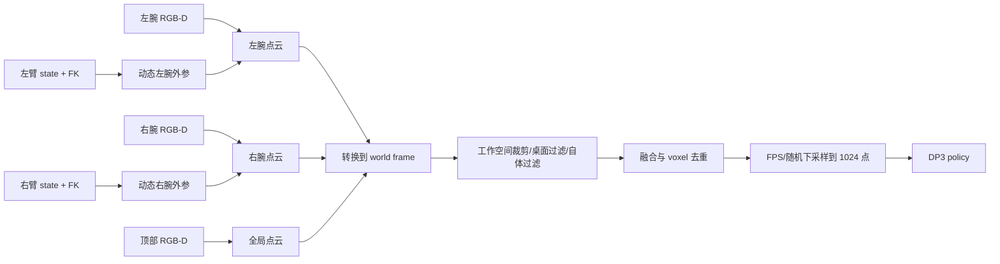
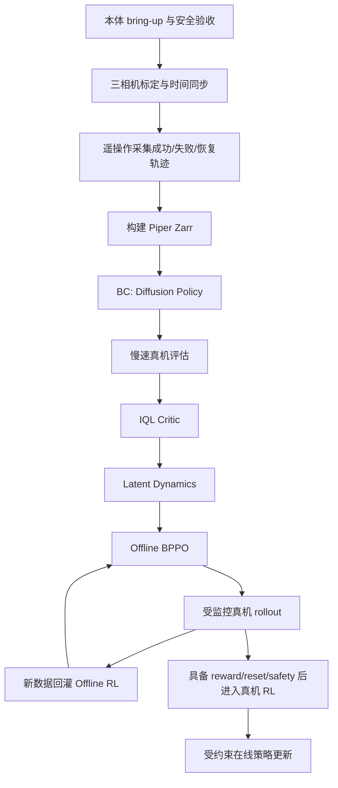

# RL-100 训练任务对 Piper 双臂项目的参考性分析

## 1. 本文目标

本文针对以下目标硬件和技术路线，分析 RL-100 仓库中哪些任务值得参考、哪些只能复用算法、哪些代码需要重写。

目标硬件：

```text
Piper 左臂 + 二指夹爪 + 腕部相机
Piper 右臂 + 二指夹爪 + 腕部相机
双臂中央上方全局相机
```

目标技术路线：

```text
遥操作采集
  -> Behavior Cloning
  -> Offline RL
  -> 受约束的真机 RL
```

这不是把现有 Adroit checkpoint 直接迁移到 Piper，而是复用 RL-100 的训练框架、数据协议和后训练方法，为 Piper 新增机器人环境与任务数据。

## 2. 核心结论

仓库中没有一套可以直接替换成 Piper 双臂并运行的完整任务。最合理的参考组合是：

```text
Flipping
  -> 双臂 action/state、真机 runner、遥操作和数据集骨架

MetaWorld
  -> 普通机械臂末端增量动作、仿真任务和成功率设计

Franka + LEAP
  -> 真机控制循环、RealSense、点云和安全接口

Adroit Door
  -> BC + Critic + Dynamics + Offline BPPO 全训练链路

ManiSkill dual arm
  -> 双臂仿真本体、关节、夹爪和碰撞配置
```

其中：

- 最接近 Piper 双臂接口的是 `Flipping`。
- 最接近 Piper 二指夹爪控制方式的是 `MetaWorld`。
- 最接近真机视觉和控制运行时的是 `Franka`。
- 当前已经跑通的 Adroit Door 主要用于验证算法链路，不用于迁移机器人动作权重。

## 3. 仓库任务参考性矩阵

| 仓库任务 | 机器人形态 | 环境 | 可复用部分 | 不可直接复用部分 | Piper 参考等级 |
|---|---|---|---|---|---|
| Adroit Door | 单只五指灵巧手 | MuJoCo | BC、IQL Critic、Dynamics、BPPO、评估流程 | 24D state、28D action、本体模型、动作语义 | 算法高，本体低 |
| MetaWorld | Sawyer 单臂 + 二指夹爪 | MuJoCo | 末端增量动作、成功判定、单臂点云任务 | Sawyer 模型、单臂 runner | 高 |
| Franka Rotate/Pour | Franka 单臂 + LEAP Hand | 真机 | RealSense、控制线程、安全、真机 env/runner | Franka SDK、LEAP 16D 手部动作 | 高 |
| UR5 PushT | UR5 单臂 + 相机 | 真机 | RTDE/控制器/RealSense 结构 | 代码未完全接通，部分 import 残缺 | 中低 |
| Flipping | 双臂系统 | 真机 | 14D 双臂接口、ZMQ、遥操作、数据集、真机 runner | 硬编码路径、旧硬件残留、reward 和 schema 问题 | 最高 |
| Folding | 疑似双臂 | 真机数据配置 | 14D action 的数据形态 | runner/dataset 存在 PushT 遗留 | 低 |
| ManiSkill Mobile A2 | 双 Panda 臂 | 仿真 | 双臂 URDF、关节、夹爪、碰撞和任务场景 | 未接入 RL-100 主训练入口 | 中高 |

## 4. 各参考任务的具体价值

### 4.1 Adroit Door：复用训练阶段，不复用本体

关键文件：

```text
RL-100/rl_100/config/task/adroit_door_medium.yaml
RL-100/rl_100/env_runner/adroit_runner.py
RL-100/rl_100/dataset/adroit_dataset.py
RL-100/train.py
```

可复用：

- Zarr 离线数据加载。
- 点云编码器和 Diffusion Policy。
- BC 训练。
- IQL 风格的 Q/V Critic。
- latent Dynamics。
- Offline BPPO。
- checkpoint、WandB 和评估流程。

不可复用：

```text
agent_pos = 24
action = 28
Adroit 五指手控制语义
door-v0 MuJoCo 环境
Adroit 相机和点云 crop
```

因此 Adroit checkpoint 不能直接加载到 Piper policy。点云 encoder 可以尝试部分迁移，但 action head、state encoder、critic 和 dynamics 应重新训练。

### 4.2 MetaWorld：二指夹爪动作设计参考

关键文件：

```text
RL-100/rl_100/config/task/metaworld_pick-place.yaml
RL-100/rl_100/env_runner/metaworld_runner.py
RL-100/rl_100/env/metaworld/
```

典型动作：

```text
[dx, dy, dz, gripper]
```

它适合参考：

- Cartesian delta action。
- 二指夹爪连续开合量。
- 工作空间限制。
- pick/place、drawer、door、button 等任务的成功条件。
- 单臂策略在点云观测上的训练与评估。

对于 Piper，可将单臂 4D 扩展成双臂 14D：每只手臂使用 6D TCP delta 和 1D gripper。

### 4.3 Franka Rotate/Pour：真机运行时参考

关键文件：

```text
RL-100/rl_100/env/franka/franka_hand_env.py
RL-100/rl_100/env_runner/rotate_runner.py
RL-100/rl_100/env_runner/pour_runner.py
RL-100/rl_100/config/task/rotate_512_arm.yaml
```

适合参考：

- 机器人状态读取线程。
- 相机采集线程。
- 真机 `reset()` 和 `step()`。
- policy 高频推理之外的低层控制插值。
- 动作限幅和异常处理。
- 真机 episode 记录和视频保存。

需要替换：

- Franka SDK。
- LEAP Hand 控制。
- Franka/相机坐标系。
- 23D state/action。

### 4.4 Flipping：Piper 双臂的主要代码骨架

关键文件：

```text
RL-100/rl_100/config/task/flipping.yaml
RL-100/rl_100/env/flipping/flipping_env.py
RL-100/rl_100/env_runner/flipping_runner.py
RL-100/rl_100/dataset/flipping_dataset.py
```

已有接口接近：

```text
agent_pos = 14
action = 14
point_cloud = 1024 × 3
```

适合复用的结构：

- 左右臂动作拼接。
- 统一 `env.step(action)`。
- 远程机器人/ZMQ 通信思路。
- 真机点云和机器人状态组合。
- 遥操作和真机 episode 组织。
- 双臂任务 dataset 类。

必须清理的问题：

- IP、端口和作者本地路径写死。
- xArm/Franka 旧实现残留。
- `agent_pos` 配置和环境内部维度不完全一致。
- `critic_dataset`、`scale_dataset` 错指 `push_t.zarr`。
- reward 依赖人工键盘成功判断。
- 没有 Piper SDK、双臂碰撞保护和 watchdog。

结论：应复制其结构新建 Piper 模块，不建议直接在 Flipping 文件中堆叠硬件分支。

### 4.5 ManiSkill dual arm：双臂仿真建模参考

关键文件：

```text
third_party/pointcloud_rl/mani_skill/mani_skill/assets/config_files/robots/mobile_a2_dual_arm.yml
third_party/pointcloud_rl/mani_skill/mani_skill/assets/config_files/push_chair.yml
third_party/pointcloud_rl/mani_skill/mani_skill/assets/config_files/move_bucket.yml
```

可参考：

- 双臂左右关节命名。
- 双夹爪配置。
- 初始关节姿态。
- 关节范围和控制增益。
- 双臂自碰撞和场景碰撞。

它不能直接提供 Piper 仿真。仍需导入 Piper URDF/MJCF，建立与真机 action contract 一致的仿真环境。

## 5. 推荐的 Piper 双臂接口契约

这个契约应在采集第一条数据之前冻结。BC、Offline RL、真机推理和真机 RL 必须使用相同定义。

### 5.1 Action：推荐 14D Cartesian delta

```text
action = [
  left_dx, left_dy, left_dz,
  left_drx, left_dry, left_drz,
  left_gripper,
  right_dx, right_dy, right_dz,
  right_drx, right_dry, right_drz,
  right_gripper
]
```

维度：

```text
左臂 7 + 右臂 7 = 14
```

推荐约定：

| 项 | 建议 |
|---|---|
| 平移单位 | 米 |
| 旋转表示 | rotvec/axis-angle 增量，单位弧度 |
| 坐标系 | 双臂公共 `world/base` frame |
| 夹爪 | 归一化连续值，例如 `[-1, 1]` |
| policy 频率 | 初期 10 Hz |
| 底层控制 | 50-100 Hz 插值与限速 |

使用公共坐标系比各自 tool frame 更适合双臂协作，因为策略能直接表达两只夹爪之间的相对运动。

备选是 14D joint delta：

```text
左 6 关节 + 左夹爪 + 右 6 关节 + 右夹爪
```

joint delta 更容易做关节安全限制，但跨初始姿态的泛化通常弱于 Cartesian delta。

### 5.2 Agent state：推荐 26D

```text
左臂关节角 6
+ 右臂关节角 6
+ 左右夹爪状态 2
+ 左右末端位姿 12
= 26
```

末端位姿每只使用：

```text
x, y, z, rx, ry, rz
```

推荐在公共 world/base frame 表示末端位姿。若只使用 14D 关节和夹爪状态，也可以从 FK 推导末端位姿，但显式提供末端位姿通常更有利于双臂协作学习。

### 5.3 初始 task yaml 形状

```yaml
shape_meta:
  obs:
    image:
      shape: [3, 84, 84]
      type: rgb
    point_cloud:
      shape: [1024, 3]
      type: point_cloud
    agent_pos:
      shape: [26]
      type: low_dim
  action:
    shape: [14]
```

初期建议：

```text
n_obs_steps = 3
n_action_steps = 1
horizon = 3
point_cloud points = 1024
use_pc_color = False
```

先用单步动作降低真机安全风险。系统稳定后再尝试 action chunk。

## 6. 三相机观测设计

### 6.1 必须确认相机是否有深度

RL-100 当前 3D policy 依赖 metric point cloud。三台相机至少需要提供可靠 depth，或能通过双目/深度模型恢复统一尺度。

如果三台都是普通 RGB 相机：

```text
不能直接生成可靠的 metric point cloud
```

此时有三种选择：

1. 将相机换成 RGB-D。
2. 使用标定好的双目深度。
3. 改用多视角 RGB encoder，而不是当前 DP3 点云路径。

单目深度网络产生的尺度和漂移会直接影响机械臂空间控制，不建议作为第一版真机 RL 的主要几何输入。

### 6.2 三台相机的职责

| 相机 | 主要作用 |
|---|---|
| 左腕相机 | 左夹爪附近接触、抓取和遮挡区域 |
| 右腕相机 | 右夹爪附近接触、抓取和遮挡区域 |
| 中央顶部相机 | 全局任务状态、双臂相对位置和目标物体布局 |

### 6.3 外参处理

顶部相机固定：

```text
T_world_global_camera = 常量
```

腕部相机随机器人运动：

```text
T_world_wrist_camera(t)
  = T_world_ee(q_t) × T_ee_wrist_camera
```

其中：

- `T_ee_wrist_camera` 来自 hand-eye calibration。
- `T_world_ee(q_t)` 来自同一时间戳的机器人 FK。

因此腕部点云必须和关节状态严格时间同步，否则移动时会出现点云拖影和错位。

### 6.4 推荐点云融合流程



第一版建议将三台相机融合成一个公共点云，以尽量复用 RL-100 现有 DP3 encoder。后续如果融合后遮挡和密度差异明显，再为三路点云增加 camera-id feature 或独立 encoder。

建议额外记录原始数据，而不是采集时只保存融合结果：

```text
left_rgb, left_depth
right_rgb, right_depth
global_rgb, global_depth
camera intrinsics
camera extrinsics / robot FK
fused_point_cloud
```

这样后续可重新标定和重建数据集。

## 7. 数据采集设计

### 7.1 BC 与 Offline RL 对数据的需求不同

BC 最需要高质量成功示范：

```text
人在当前观测下发出了什么动作
```

Offline RL 还需要质量差异和奖励：

```text
哪些动作/轨迹更好，哪些更差
```

因此不要只保存完全成功的数据。推荐分层采集：

| 数据类型 | 用途 |
|---|---|
| 高质量成功遥操作 | BC 主数据 |
| 较慢、绕路但成功 | Critic 学习价值差异 |
| 部分完成后失败 | Critic、Dynamics |
| 安全范围内的 policy rollout | Offline RL 数据迭代 |
| 人工接管恢复片段 | 学习纠错和安全恢复 |

首个任务可将以下数量作为工程起点，而不是硬性标准：

```text
100-300 条成功示范
30-100 条部分成功/失败/恢复轨迹
独立保留 10%-20% 场景作为验证集
```

任务复杂度、初始状态随机化和遥操作质量会显著影响所需数量。

### 7.2 每个时间步必须同步记录

```text
timestamp
left/right joint position
left/right joint velocity（建议保留）
left/right gripper state
left/right end-effector pose
三路 RGB/depth
三路相机内外参或可恢复外参所需的 FK
policy/teleop commanded action
实际执行后的 action
reward
success/failure label
done
timeout
human intervention flag
```

训练中的 `action` 应优先保存“实际送入安全控制器并执行的命令”，而不是安全裁剪之前的原始遥操作命令。

### 7.3 Zarr schema

建议最终转换为：

```text
data/
  state
  next_state
  action
  next_action
  point_cloud
  next_point_cloud
  img
  next_img
  reward
  return
  done
  timeout
meta/
  episode_ends
```

三路原始相机建议另外保留在 raw dataset 中，训练 zarr 可只保留融合点云和选定的 RGB 图像，避免数据体积过大。

## 8. BC -> Offline RL -> 真机 RL 路线



### 8.1 阶段 A：BC

目标：

```text
先得到一个能稳定完成基本动作、不会随机乱动的策略
```

验收建议：

- 离线 action MSE/denoising loss 收敛。
- 固定验证集动作分布合理。
- dry-run 输出无 NaN、无越界。
- 低速真机成功率达到可接受水平。
- 三相机点云在线分布与训练数据一致。

### 8.2 阶段 B：Offline RL

按 RL-100 当前链路：

```text
BC
-> IQL Critic Q/V
-> latent Dynamics
-> Offline BPPO
```

Critic 需要可靠 reward。Dynamics 需要正确的 `next_state/next_point_cloud` 和时间对齐。真实机器人中 dynamics extrapolation 风险更高，应：

- 使用较短 rollout length 开始，例如 3。
- 对模型不确定性高的轨迹降权或拒绝。
- 保持 BPPO clip 较保守。
- 比较 BC 与 Offline RL 的真机成功率和动作平滑度。
- 不因 Q 值提升就直接认为策略更安全。

### 8.3 阶段 C：真机 RL

真机 RL 不是简单设置 `online=True`。进入前必须具备：

```text
自动 reward
自动或低成本 reset
动作安全过滤
双臂碰撞检测
watchdog 和急停
人工接管
在线数据日志和回滚 checkpoint
```

推荐采用保守在线更新：

- 从 Offline RL 最佳 checkpoint 初始化。
- 小学习率。
- 小 exploration/noise。
- action clipping 和 workspace projection。
- 保留 BC/offline 数据，与在线 buffer 混合训练。
- 人工接管动作进入 replay buffer。
- 失败率或碰撞风险上升时自动回滚。

第一版真机 RL 更建议做“短批量 rollout -> 离线更新 -> 再部署”的 off2off 循环。等 reward、reset 和安全系统成熟后，再开启训练进程内的连续 online update。

## 9. Reward 与任务选择

Offline RL 和真机 RL 都依赖 reward。仅靠人工成功按钮可以做实验，但不适合高频在线学习。

### 9.1 推荐的任务推进顺序

1. 双臂同步到目标位姿，不接触物体。
2. 双臂共同抬起大物体并放置。
3. 一只夹持、一只调整姿态。
4. 双臂翻转刚体物体。
5. 双臂递交/换手。
6. 双臂装配、插接或开门。

不要将开门作为第一个 Piper 真机 RL 任务。二指夹爪操作门把手包含接触、旋转、拉动和双臂协调，reset 成本也高。

### 9.2 Reward 来源候选

| Reward | 实现方式 |
|---|---|
| 物体位置/姿态误差 | AprilTag、ArUco、外部视觉或任务传感器 |
| 夹爪到目标距离 | FK + 视觉目标位姿 |
| 双臂相对位姿 | 双臂 FK |
| 抓取状态 | 夹爪开度、电流、力或物体跟踪 |
| 成功奖励 | 视觉规则或任务开关 |
| 安全惩罚 | 越界、碰撞预测、速度过大、人工接管 |

建议同时保存原始任务测量量，后续可以离线重新计算 reward，而不必重新采集轨迹。

## 10. 安全设计

安全不能只放在 policy 中，应分层：

```text
Policy output
  -> 动作反归一化
  -> 单步位移/旋转限制
  -> workspace 限制
  -> IK 与关节限制
  -> 双臂自碰撞和环境碰撞检查
  -> 速度/加速度插值
  -> Piper SDK
```

还需要：

- 硬件急停。
- 通信超时自动停止。
- 相机/状态时间戳异常时停止发动作。
- policy 推理超时保持或停止，而不是重复旧动作。
- 双臂共享 watchdog。
- 真机 RL 的探索动作采用更严格阈值。

## 11. 建议新增的代码结构

```text
RL-100/rl_100/env/piper/
  piper_dual_arm_env.py
  piper_client.py
  camera_manager.py
  calibration.py
  pointcloud_fusion.py
  safety.py
  reward.py

RL-100/rl_100/env_runner/
  piper_dual_arm_runner.py

RL-100/rl_100/dataset/
  piper_dual_arm_dataset.py

RL-100/rl_100/config/task/
  piper_dual_arm_<task>.yaml

tools/teleop_off2off_data/
  piper_dual_arm_teleop.py
  piper_raw_to_zarr.py
  validate_piper_zarr.py
```

不要把 Piper 逻辑直接写进 `AdroitEnv`、`FrankaEnv` 或 `FlippingEnv`。复制可复用结构并建立明确的 Piper ownership，后续维护会更清晰。

## 12. RL-100 当前代码在 Piper 路线中的注意点

### 12.1 30 个超参数组合共用输出目录

当前 `train_policy.sh` 会运行：

```text
3 bppo_lr × 5 rollout_length × 2 clip_std_max = 30 runs
```

但输出目录不包含这三个参数，并且 `training.resume=True`。Piper 实验必须先修正，防止不同实验互相覆盖或加载 checkpoint。

### 12.2 `only_bc=True` 不会停止后续阶段

当前代码中它主要用于保存 BC policy。只要：

```text
offline=True
```

仍会继续训练 Critic、Dynamics 和 Offline BPPO。Piper bring-up 阶段应增加真正的 `bc_only` 退出控制，避免误启动后训练或真机评估。

### 12.3 `distill_phase` 拼写

当前脚本：

```text
after_offlin
```

代码识别：

```text
after_offline
```

该问题会使 offline 后蒸馏不触发。

### 12.4 真机 runner 不能默认并行多个 env

仿真中可以使用多个并行环境，Piper 真机第一版应固定：

```text
env_num = 1
```

并明确区分训练 batch 并行与真实机器人实例数量。

### 12.5 数据和在线观测必须共用同一预处理

必须保证以下操作由同一份代码执行：

```text
坐标变换
点云 crop
桌面/机器人过滤
点数采样
state 拼接顺序
action scale
normalization
```

否则 BC 离线指标可能正常，但真机策略会因输入分布不一致而失败。

## 13. 推荐实施里程碑

### M0：只读与安全

- 双臂状态读取稳定。
- 三相机流稳定。
- 时间戳统一。
- 急停、watchdog 和小动作 dry-run 通过。

### M1：观测和动作契约

- 14D action 固定。
- 26D state 固定。
- 三相机标定和融合点云稳定。
- 在线/离线预处理单元测试通过。

### M2：遥操作和数据集

- 双臂遥操作可完成第一个简单任务。
- raw 数据可回放。
- zarr schema 验证通过。
- reward/return/done/timeout 可重算。

### M3：BC

- BC 离线收敛。
- 真机低速评估稳定。
- 建立 BC baseline 成功率和安全指标。

### M4：Offline RL

- Critic 和 Dynamics 验证误差可控。
- Offline BPPO 不明显偏离数据分布。
- 真机评估优于或不劣于 BC，且安全指标不下降。

### M5：Off2Off 数据闭环

- policy rollout、失败和人工接管数据自动入库。
- 新旧数据版本可追溯。
- 支持离线重新训练和 checkpoint 回滚。

### M6：受约束真机 RL

- 自动 reward 和 reset 可用。
- 在线 buffer 与 offline buffer 混合。
- 安全过滤、人工接管和自动回滚完整。
- 小规模上线后逐步扩大探索范围。

## 14. 最终建议

Piper 双臂路线应以 `Flipping` 的双臂组织方式为骨架，以 `MetaWorld` 的末端增量动作作为控制设计参考，以 `Franka` 的真机相机和安全逻辑作为运行时参考，并复用 Adroit 已验证的 BC/Offline RL 训练阶段。

第一版最重要的不是立刻运行 Offline BPPO，而是先冻结以下四个契约：

```text
14D 双臂 action
26D robot state
三相机到公共 world frame 的标定与同步
可自动重算的 reward/success
```

这四项一旦在采集后频繁变化，已有数据和 checkpoint 会很快失去可用性。先把它们做稳，再进入 BC、Offline RL 和真机 RL，整体成本最低。
