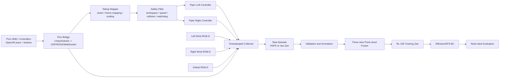

# Piper 单臂/双臂 Pick-and-Place：Pico VR 数据采集方案

本文给出一套面向 RL-100 的真机数据采集方案。硬件假设如下：

- 两台 Piper 机械臂，每臂 6 DoF。
- 每臂一个二指夹爪。
- 左、右腕部各一台相机，双臂中央上方一台全局相机。
- 使用 Pico 头显和左右控制器进行 VR 遥操作。
- 第一阶段训练 BC，之后扩展到 offline RL 和真机 RL。

方案的核心原则是：**先保存信息完整、可重新处理的原始数据，再生成与某个模型配置绑定的 RL-100 Zarr 数据集。** 不要在采集时只保存已经下采样的 1024 点点云，否则相机标定、裁剪或状态定义发生变化后只能重新采集。

## 1. 结论和推荐路线

推荐按以下顺序推进：

```text
单臂固定物体/固定目标区
  -> 单臂随机物体位置和目标位置
  -> 左右臂分别完成单臂 Pick-and-Place
  -> 双臂分别搬运两个物体
  -> 双臂共同搬运一个大物体
  -> BC 真机评估
  -> 加入失败和恢复轨迹进行 offline RL
  -> 安全条件满足后进行小范围真机 RL
```

不建议第一批数据就直接采集高难度双臂共同抓取。先用单臂任务验证以下整条链路：

```text
Pico pose -> Piper target -> robot execution
          -> three-camera synchronization
          -> raw episode -> point-cloud fusion -> RL-100 Zarr
          -> BC training -> real-robot rollout
```

原始采集格式可以统一支持单臂和双臂，但训练数据应按任务拆分。不要把 7D action 和 14D action 放进同一个 Zarr。

## 2. 任务定义

### 2.1 单臂 Pick-and-Place

第一版任务建议使用颜色和形状稳定、容易夹取的刚性物体，例如边长 5-8 cm 的方块或圆柱体，并使用明确的目标托盘。

一个 episode 的标准流程：

1. 机械臂位于统一 home pose，夹爪打开。
2. 物体随机放在允许的起始区域。
3. 目标托盘随机放在允许的目标区域。
4. 操作者通过 Pico 控制机械臂接近、抓取、抬起、移动、放置。
5. 物体完全进入目标区且机械臂释放后，标记成功。
6. 碰撞、掉落、越界或超时则标记失败并记录失败原因。

建议先分别建立两个任务：

```text
piper_left_pick_place
piper_right_pick_place
```

每个模型使用 7D action：

```text
[dx, dy, dz, drx, dry, drz, gripper]
```

三台相机仍然全部采集。单臂模型可以同时看到两个腕部视角和全局视角，即使非工作臂保持在固定安全位。

### 2.2 双臂 Pick-and-Place

双臂阶段建议拆成两个难度层次。

**任务 A：双臂独立搬运**

- 左臂抓取左侧物体，右臂抓取右侧物体。
- 分别放入左右目标区。
- 用来验证 14D action、同步控制和双臂避碰。

**任务 B：双臂共同搬运**

- 两臂从物体两侧同步抓取一个长盒或托盘。
- 同步抬起、平移并放入目标区。
- 用来验证双臂协同、相对位姿约束和负载变化。

双臂模型使用固定 14D action：

```text
[
  left_dx, left_dy, left_dz,
  left_drx, left_dry, left_drz,
  left_gripper,
  right_dx, right_dy, right_dz,
  right_drx, right_dry, right_drz,
  right_gripper
]
```

建议把“独立搬运”和“共同搬运”先做成两个数据集和两个 task yaml。二者成熟后再考虑加入 `task_id` 做多任务训练。

## 3. 系统总体架构



建议让采集主机成为统一时间源。Pico、相机和机器人消息进入主机后，都附带主机的 `time.monotonic_ns()` 接收时间；设备自身时间戳另存一份，不能只使用文件写入时间。

## 4. Pico VR 遥操作设计

### 4.1 Pico 侧需要实现的接口

仓库当前的 `tools/teleop_off2off_data/teleop.py` 使用 `VisionProStreamer`，不能直接连接 Pico。Pico 侧需要一个小型 OpenXR/Unity 应用或已有串流程序，向采集主机持续发送：

```text
timestamp_device
head_pose
left_controller_pose
right_controller_pose
left_trigger / right_trigger
left_grip / right_grip
joystick and buttons
tracking_valid flags
sequence_number
```

推荐网络消息使用带版本号的结构化格式，例如 protobuf、ROS2 message 或 MessagePack。调试期可用 JSON，正式采集不建议依赖无 schema 的 JSON。

推荐更新频率：

| 数据 | 建议频率 |
| --- | --- |
| Pico 控制器 pose | 72-90 Hz，至少 60 Hz |
| Piper 状态读取 | 50-100 Hz，按 SDK 能力确定 |
| Piper 底层目标更新 | 50 Hz 左右，并由底层插值 |
| 三路 RGB-D | 30 Hz，同分辨率/帧率 |
| policy/训练 transition | 10 Hz 起步，可验证后提高到 20 Hz |

### 4.2 控制器按键映射

建议的最小映射：

| 输入 | 功能 |
| --- | --- |
| 左/右 Grip 长按 | 对应机械臂 deadman，松开立即保持或停止 |
| 左/右 Trigger | 对应夹爪连续开合或二值开合 |
| A/X | clutch/recenter，仅重置 VR 相对参考，不移动机器人 |
| B/Y | 请求结束 episode，不直接判定成功 |
| 双手特定组合 | 开始采集，必须避免误触 |
| 独立物理急停 | 立即停止双臂，不能依赖 Pico 网络 |

成功/失败标注建议由旁站人员在主机键盘或独立面板确认。不要让操作者用容易误触的控制器按键同时承担运动控制和最终标签。

### 4.3 VR pose 到机器人 pose

开始一个控制片段或按下 clutch 时，记录：

```text
T_vr_controller_0
T_base_ee_0
```

之后根据控制器相对运动生成末端目标：

```text
Delta_T_vr(t) = inverse(T_vr_controller_0) * T_vr_controller(t)
Delta_T_base(t) = axis_map_and_scale(Delta_T_vr(t))
T_base_ee_target(t) = T_base_ee_0 * Delta_T_base(t)
```

这里必须明确：

- Pico/OpenXR 坐标系和 Piper base 坐标系的轴方向。
- OpenXR pose 的矩阵乘法约定和四元数顺序。
- 平移缩放比例，第一版建议 0.5-0.8 倍。
- 左右臂是否镜像，不要通过猜符号实现。
- 平移单位统一为米，旋转统一为弧度。

上线前分别做 `+x/+y/+z` 和绕三轴小角度测试，记录期望方向和实际方向。不要在双臂同时使能时第一次验证坐标映射。

### 4.4 遥操作安全过滤

每个目标发送前至少经过：

```text
tracking validity
network timeout
workspace bounds
joint limit and IK validity
per-step translation/rotation clipping
Cartesian/joint velocity limit
self-collision and inter-arm exclusion zone
table and camera collision bounds
gripper command bounds
```

初始建议限制：

- policy/teleop 每个 0.1 s transition 的平移不超过 1-2 cm。
- 旋转不超过 3-5 度。
- 使用小于额定速度的 10%-20% 完成首轮采集。
- Pico tracking 丢失、消息超过 100 ms 未更新或采集进程异常时立即 hold。

具体数值必须结合 Piper SDK 的控制模式和厂家限制再次确认，不能把上述起步值直接当作硬件安全认证值。

## 5. 三相机配置与标定

### 5.1 相机要求

RL-100 当前 3D 路线使用点云，因此三台相机最好都是 RGB-D。若腕部相机只有 RGB：

- 不能直接从该视角生成可靠点云；
- 可以仅用全局 RGB-D 生成点云，同时保存腕部 RGB；
- 或改造成多视角 2D policy，此时要修改 dataset、`shape_meta` 和模型输入。

第一版推荐所有相机统一设置：

```text
RGB: 640x480 @ 30 Hz
Depth: 640x480 @ 30 Hz
depth aligned to color
auto exposure locked after warm-up when possible
```

原始数据保存 `uint8 RGB` 和原始 `uint16 depth`，同时保存每台相机的 `depth_scale`。不要在原始层直接保存为 float32 米制深度，空间开销更大且容易丢失设备语义。

### 5.2 必需标定

每台相机保存：

```text
K_color, distortion_color
K_depth, distortion_depth
T_color_depth
depth_scale
serial_number
firmware/configuration
calibration_version
```

外参分两类：

**固定全局相机：**

```text
T_world_global_camera
```

通过 AprilTag/标定板和机器人基座完成 eye-to-hand 标定。

**左右腕部相机：**

```text
T_left_tcp_left_camera
T_right_tcp_right_camera
```

通过 hand-eye 标定获得。每个采样时刻根据机器人 FK 计算：

```text
T_world_left_camera(t) = T_world_left_tcp(t) * T_left_tcp_left_camera
T_world_right_camera(t) = T_world_right_tcp(t) * T_right_tcp_right_camera
```

三路点云都转换到同一个 `world` 坐标系后再融合。`world` 建议固定在双臂公共工作台坐标系，不要分别使用左右 Piper 的 base frame。

### 5.3 标定验收

至少完成以下检查：

1. 三路点云中的同一标定板重合。
2. 腕部移动后，静止物体在 world 点云中的位置基本不漂移。
3. 用已知尺寸物体检查深度尺度。
4. 检查左右相机是否串号。
5. 每天开机采集一个 10 秒标定验证片段。

建议目标：工作区域内三视角静态物体的点云错位尽量控制在 1 cm 内。若抓取精度要求更高，应进一步收紧并根据实测误差决定。

## 6. 时间同步和 transition 对齐

时间同步错误会让模型学到“看到旧画面后执行新动作”。三相机系统必须显式处理时间戳。

### 6.1 原始流必须分别保存

每条流都保存：

```text
device_timestamp
host_receive_timestamp_monotonic
sequence_number
valid/drop flag
payload
```

不要在采集线程中直接把“最近一帧相机 + 最近一次机器人状态”拼成唯一记录后丢掉原始时间戳。

### 6.2 生成训练 transition

以 10 Hz 的控制时刻 `t_k` 为锚点：

1. 对关节和 TCP 状态按时间插值到 `t_k`。
2. 为每台相机选取最接近 `t_k - camera_latency` 的完整 RGB-D frame。
3. 记录在 `[t_k, t_(k+1))` 真正下发给控制器的命令作为 `action[k]`。
4. 在 `t_(k+1)` 生成 `next_state` 和 `next_point_cloud`。
5. 若任一关键流超出最大时间差，丢弃该 transition 或整个 episode。

建议从以下同步门限开始验证：

```text
三相机之间最大偏差 <= 33 ms
相机与 transition 锚点偏差 <= 50 ms
机器人状态插值跨度 <= 20 ms
```

这些是工程起点，不是固定真值。应通过录制 LED/机械运动等实验测量真实的相机曝光、网络和执行延迟，再写入数据集版本。

## 7. Observation 和 Action 契约

### 7.1 原始机器人状态

原始层每臂至少保存：

```text
joint_position[6]
joint_velocity[6]
joint_torque/current[6]    # SDK 可用时
tcp_position[3]
tcp_quaternion_xyzw[4]
gripper_position[1]
gripper_force/current[1]  # 可用时
robot_mode / error_code
```

即使第一版 policy 不使用速度和电流，也应保留，后续可用于延迟分析、碰撞检测和真机 RL 安全过滤。

### 7.2 RL-100 `agent_pos`

双臂第一版建议使用 26D：

```text
left_joint_position[6]
+ left_gripper_position[1]
+ left_tcp_position[3]
+ left_tcp_rotvec[3]
+ right_joint_position[6]
+ right_gripper_position[1]
+ right_tcp_position[3]
+ right_tcp_rotvec[3]
= 26D
```

单臂模型可使用对应单臂的 13D 状态，也可以保留双臂 26D 状态。推荐：

- 快速验证单臂算法时使用 13D。
- 若明确要迁移到双臂，原始层始终保存双臂状态，训练层再决定 13D 或 26D。

旋转在原始层必须保存四元数；转换为 policy 输入时才生成 rotvec，并执行四元数符号连续化，避免 `q` 和 `-q` 引起跳变。

### 7.3 Action 定义

推荐 policy action 使用**相邻控制目标之间的末端增量**，在公共 world frame 表示：

```text
delta_position: meters
delta_rotation: rotation vector, radians
gripper: normalized absolute target in [-1, 1]
```

单臂为 7D，双臂为 14D。必须同时在原始数据中保存：

```text
vr_raw_pose
unfiltered_target_pose
safety_filtered_target_pose
command_sent_to_robot
measured_tcp_pose
```

BC 的 action label 使用最终传给 `env.step()`/Piper 控制器的安全过滤后命令，而不是 Pico 原始控制器位姿。测量到的 TCP 增量用于诊断跟踪误差，不应悄悄替换 action 定义。

### 7.4 Point cloud

每个 transition：

1. 三路 depth 各自转点云。
2. 利用该时刻外参转换到公共 world frame。
3. 合并三路点云。
4. 去除无效深度、离群点和重复点。
5. 按工作空间裁剪。
6. 可选过滤桌面和机器人本体点。
7. 体素降采样后采样为固定 `1024 x 3`。

建议第一版只训练 XYZ，原始层保留 RGB，后续可扩展为 `1024 x 6` 的 XYZRGB。离线处理和真机 runner 必须调用同一份点云预处理代码和同一个配置版本。

## 8. 原始数据格式

三路图像不适合继续沿用仓库当前“每条 demo 一个 object NPY”的方式。建议每个 episode 保存一个 HDF5 或 raw Zarr，并在 episode 完成后原子重命名：

```text
data/piper_pick_place/raw/
  session_20260715_operator01/
    calibration_snapshot/
    episode_000001.h5.partial
    episode_000001.h5
    episode_000001.json
```

推荐原始 HDF5 结构：

```text
meta/
  schema_version
  task_name
  arm_mode
  operator_id
  object_id
  start_region_id
  target_region_id
  calibration_version
  success
  termination_reason
  failure_reason

robot/left/...                   # timestamp + state streams
robot/right/...
teleop/pico/...                 # controller pose/buttons/tracking
command/left/...
command/right/...

camera/left_wrist/rgb
camera/left_wrist/depth
camera/left_wrist/timestamp
camera/right_wrist/...
camera/global/...

events/
  episode_start
  grasp
  lift
  place
  release
  episode_end
```

每个 episode 旁边保存小型 JSON manifest，便于不打开大文件就统计成功率、长度、物体和场景分布。

## 9. RL-100 训练 Zarr

处理后的数据应满足仓库现有 dataset contract：

```text
data/
  point_cloud          [N, 1024, 3]
  next_point_cloud     [N, 1024, 3]
  state                [N, 13 or 26]
  next_state           [N, 13 or 26]
  action               [N, 7 or 14]
  next_action          [N, 7 or 14]
  reward               [N, 1]
  return               [N, 1]
  done                 [N, 1]
  timeout              [N, 1]
meta/
  episode_ends         [num_episodes]
```

同时建议在 Zarr attrs 中记录：

```text
schema_version
raw_source_manifest
git_commit
task_definition_version
calibration_version(s)
point_cloud_config
state_fields and ordering
action_fields and ordering
control_hz
latency_compensation
train/val/test episode ids
```

### 9.1 Reward、done 和 timeout

BC 可以只使用 observation/action，但后续 offline RL 依赖正确的 transition 标签，因此第一批数据就应完整标注：

```text
reward = 1 at verified success transition, otherwise 0
done = true for task success, unrecoverable failure, safety stop
timeout = true only when time limit is reached
is_success = episode-level verified success
```

当前 `data_prepare.py` 对 teleop 数据把 `timeout` 同时当作 episode boundary 和 `done`，Piper 版本不能直接照搬。应根据 `termination_reason` 分别生成 `done` 和 `timeout`，并独立维护 `episode_ends`。

### 9.2 当前工具不能直接复用的部分

现有文件：

```text
tools/teleop_off2off_data/teleop.py
tools/teleop_off2off_data/data_prepare.py
```

存在以下硬件绑定：

- 使用 Vision Pro 的 `VisionProStreamer`，不是 Pico/OpenXR。
- 使用 xArm + Franka wrapper，不是 Piper。
- 只读取一台 RealSense。
- `RAW_CAMERA_INTRINSICS` 和相机外参写死。
- `raw_to_npy` 读取 `ee_euler_action`，与采集脚本保存的字段并不完全一致。
- 没有三相机独立时间流和动态腕部相机外参。
- 原始 NPY 不适合保存三路视频规模的数据。

建议新增而不是继续堆硬编码：

```text
tools/piper_pico_teleop/
  pico_bridge.py
  piper_dual_arm.py
  camera_manager.py
  safety_filter.py
  episode_recorder.py
  configs/collect_pick_place.yaml

tools/piper_data/
  validate_raw.py
  build_training_zarr.py
  point_cloud_fusion.py
  configs/pick_place_v1.yaml
```

数据处理完成后仍可复用 RL-100 的 ReplayBuffer、SequenceSampler、normalizer 和训练入口。

## 10. 数据覆盖和采集数量

### 10.1 变化维度

每个 episode 的 manifest 至少记录：

```text
object_id / object_category
object_start_region and continuous pose
target_region and pose
working_arm(s)
lighting_condition
background/session
operator_id
success/failure reason
```

第一版不要一次引入过多物体类别。建议：

| 阶段 | 物体 | 起点 | 目标 | 目标 |
| --- | --- | --- | --- | --- |
| 工程验证 | 1 个 | 固定 | 固定 | 验证链路 |
| 小规模 BC | 1-2 个 | 3-5 个区域 | 2-3 个区域 | 验证泛化 |
| 稳定 BC | 3-5 个 | 连续随机 | 连续随机 | 提高鲁棒性 |
| Offline RL | 同 BC + 边界位置 | 包含困难状态 | 包含困难目标 | 学习恢复 |

### 10.2 数量建议

| 阶段 | 单臂 | 双臂 | 数据用途 |
| --- | --- | --- | --- |
| Smoke test | 每臂 5-10 条成功 | 5-10 条 | schema、同步、BC forward |
| Pilot BC | 每臂 30-50 条成功 | 30-50 条 | 检查能否过拟合和真机执行 |
| BC baseline | 每臂 100-200 条成功 | 150-300 条成功 | 建立可评估 baseline |
| Offline RL 初版 | 追加 50-150 条成功/失败/恢复 | 追加 100-300 条 | critic、IQL、dynamics |

这些不是 RL-100 的硬编码要求。最终数量应由 held-out 场景成功率和失败类型决定。长时间但低质量的轨迹不应替代短、稳定、覆盖充分的轨迹。

### 10.3 数据划分

必须按 episode 划分，不能随机拆 frame：

```text
train: 80%
validation: 10%
test: 10%
```

测试集至少留出部分未见过的起点/目标组合；如果要评估物体泛化，再单独留出一个物体。相邻 episode、同一连续摆放序列不要跨 train/test，以免场景泄漏。

## 11. 采集操作规程

### 11.1 每日开始前

1. 检查急停、Piper 错误状态和夹爪。
2. 确认双臂 home pose 和公共 world frame。
3. 三相机预热并锁定配置。
4. 校验设备 serial 与左右/全局角色映射。
5. 采集标定验证片段并检查三路点云重合。
6. 测试 Pico tracking、clutch、deadman 和网络超时停机。
7. 录制一条 dry-run，立即回放状态、动作和三路图像。

### 11.2 每个 episode

1. 生成并记录场景 ID、物体、起点和目标。
2. 人工复位物体和机器人。
3. 检查相机、机器人、Pico 所有流均为 valid。
4. 开始录制后静止 1 秒，建立同步基线。
5. 执行任务，动作应自然连续，不追求刻意慢速。
6. 完成后保持 0.5-1 秒，确保成功状态被视觉记录。
7. 旁站人员标记成功、失败或作废，并填写原因。
8. 文件 flush、关闭并从 `.partial` 原子改名。

### 11.3 应作废的 episode

出现以下任一情况应标记 invalid，不进入 BC：

- 任一关键相机丢失较长片段或 RGB/depth 不匹配。
- Pico tracking 丢失、跳变或控制器重定位。
- 机器人报错、通信中断或人工急停。
- 时间戳倒退、重复或同步偏差超限。
- 标定版本不明或相机安装发生移动。
- 操作者在任务结束后误操作，但没有正确切分 episode。
- 动作/状态出现 NaN、单位错误或明显越界。

失败轨迹不等于无效轨迹。执行正确但任务失败的数据应保留，在 BC 数据筛选和 offline RL 数据集中采用不同策略。

## 12. 自动质量检查

每次采集结束自动输出报告：

```text
episode count and success rate
duration / transition count distribution
camera FPS and dropped frames
three-camera timestamp skew
robot/Pico message latency
tracking invalid ratio
joint/workspace/action ranges
command versus measured tracking error
point-cloud valid point count and bounds
calibration version consistency
duplicate episode/hash detection
NaN/Inf and discontinuity detection
```

每批数据随机可视化至少 10 条：

- 三路 RGB-D 同步回放。
- 融合点云和机器人 TCP 轨迹。
- Pico 控制器轨迹、下发 target 和实测 TCP 对比。
- `obs[t] -> action[t] -> obs[t+1]` 对齐。

建议设置以下进入训练前的最低门槛：

```text
100% episode 可以解析
0 NaN/Inf
所有 shape、单位和字段顺序一致
所有 episode_ends 单调且最后等于 N
训练集与测试集 episode 无重叠
随机回放未发现动作错位或左右臂交换
policy 在线点云预处理与离线处理逐字段一致
```

## 13. 分阶段实施和验收

### 阶段 0：硬件只读和记录器

实现 Piper 状态读取、三相机采集、Pico pose 接收，但不发运动命令。

验收：连续录制 30 分钟无崩溃，时间戳和设备序列号完整。

### 阶段 1：单臂 VR 控制

只启用一条机械臂，完成坐标映射、clutch、deadman、限速和急停。

验收：沿六个 Cartesian 方向可预测移动，tracking 丢失时可靠停止。

### 阶段 2：三相机点云

完成固定相机外参、双腕 hand-eye 和动态点云融合。

验收：腕部移动时静止物体在 world frame 中不随相机明显漂移。

### 阶段 3：10 条 smoke 数据

生成 raw episode 和 RL-100 Zarr，运行 shape 检查和 BC 小规模过拟合。

验收：模型能过拟合少量数据；真机 dry-run action 的维度、单位和方向正确。

### 阶段 4：单臂 BC baseline

每臂采集 100-200 条高质量成功数据，建立 held-out 测试场景。

验收：单臂真机成功率达到预先设定的门槛，并完成失败类型统计。

### 阶段 5：双臂 BC

先独立搬运，再共同搬运；启用双臂碰撞约束并采集 14D action。

验收：双臂动作无左右错位，协同任务在 held-out 场景有稳定成功率。

### 阶段 6：Offline RL 数据准备

保留 BC policy rollout 的成功、失败和恢复轨迹，补充准确 reward、done、timeout 和 `next_*`。

验收：critic/dynamics 使用的数据 transition 连续，reward 与视频人工抽查一致。

## 14. 和 RL-100 的接入清单

数据采集完成后，至少需要新增或修改：

```text
tools/piper_pico_teleop/                 # Pico + Piper + cameras recorder
tools/piper_data/build_training_zarr.py  # raw -> RL-100 Zarr
RL-100/rl_100/dataset/piper_pick_place_dataset.py
RL-100/rl_100/config/task/piper_left_pick_place.yaml
RL-100/rl_100/config/task/piper_right_pick_place.yaml
RL-100/rl_100/config/task/piper_dual_pick_place.yaml
RL-100/rl_100/env/piper/piper_env.py
RL-100/rl_100/env_runner/piper_pick_place_runner.py
```

双臂 task yaml 的关键 shape 示例：

```yaml
shape_meta:
  obs:
    point_cloud:
      shape: [1024, 3]
      type: point_cloud
    agent_pos:
      shape: [26]
      type: low_dim
  action:
    shape: [14]
```

单臂版本相应使用 `agent_pos: [13]`、`action: [7]`。如果模型还要直接使用三路 RGB，需要为每个视角增加独立 key，不能把三张图未经约定地拼到当前单个 `image` 字段中。

## 15. 开始采集前必须冻结的参数

以下内容应写入 `collect_pick_place.yaml` 并进行版本控制：

```text
Pico pose/button message schema
VR-to-world axis mapping and translation scale
left/right arm association
Piper command mode and control frequency
state field ordering and units
action field ordering, frame, units and clipping
gripper normalization and open/close semantics
three camera serial numbers and stream profiles
camera calibration version
world frame definition
point-cloud crop and sampling configuration
episode success/failure/timeout definitions
maximum episode duration
timestamp alignment and latency compensation
raw schema version and processed schema version
```

这份契约一旦用于正式采集，不应在同一数据集目录中静默修改。发生字段、单位、标定或控制模式变化时创建新版本，并保留从 raw 数据重新生成训练数据的能力。
