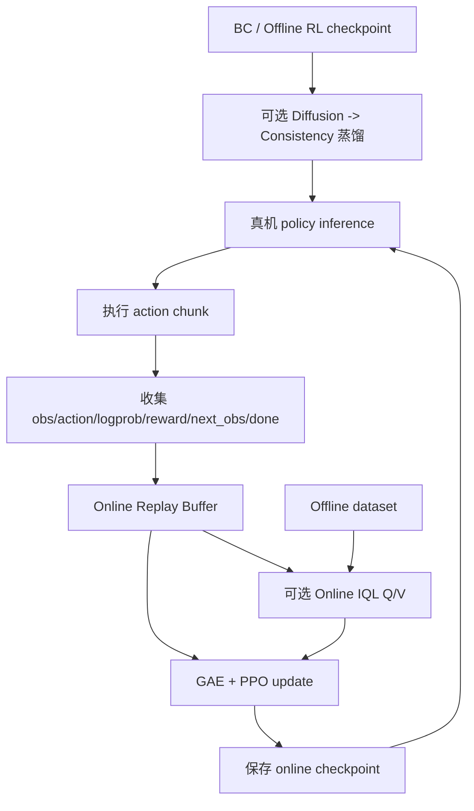

# RL-100 真机 Online RL 实现说明与 Piper 迁移建议

## 1. 范围与结论

RL-100 的真机 Online RL 主要体现在 Flipping 双臂任务中，核心入口是：

```text
scripts/train_policy_online_cm_flip.sh
RL-100/train_real.py
RL-100/rl_100/env/flipping/flipping_env.py
RL-100/rl_100/gym_util/multistep_wrapper_real.py
RL-100/rl_100/unidpg/uni_ppo.py
```

它不是简单把仿真 PPO 搬到真机，而是：

```text
Offline BC/RL checkpoint 初始化
+ Diffusion/Consistency Policy
+ 真机在线 transition
+ GAE/PPO
+ 可选 Online IQL
+ offline/online 数据混合
+ reconstruction/distillation 约束
```

算法闭环较完整，但机器人接口、reward、reset 和安全仍是面向作者硬件的研究原型，不能直接用于 Piper。

## 2. 整体流程



## 3. 从离线 checkpoint 启动

真机 RL 不从随机策略开始。脚本通过：

```text
offline_cp_timestamp
offline_cp_timestep
ppo.load_online_cp
```

加载：

- BC/Offline BPPO checkpoint。
- offline best policy。
- 已有 online checkpoint。
- 可选 distilled consistency model。

这种初始化对真机非常重要：

```text
先通过遥操作/离线数据获得基本可用策略
  -> 再允许真实交互和小幅更新
```

## 4. Diffusion Policy 在线蒸馏

Diffusion Policy 一次动作需要多步去噪，推理延迟可能不适合真机控制。RL-100 支持：

```text
多步 Diffusion teacher
  -> consistency/student policy
  -> 一步或少步生成动作
```

Flipping 脚本包含：

```text
distill_phase = online
distill_steps = 50
lr_cm = 1e-6
```

目的：

- 降低真机 inference latency。
- 减少 diffusion 多步采样开销。
- 使用 teacher/reconstruction loss 约束在线 student。

Online distillation 需要已有 offline policy 和 distilled checkpoint，不能将随机 student 直接部署真机。

## 5. 真机 transition 收集

在线 replay buffer 保存：

```text
obs
action
old action log probability
reward
next_obs
done
dw / timeout
```

视觉任务还会保存：

```text
point_cloud
image
agent_pos
next_point_cloud
next_image
next_agent_pos
```

部分 rollout 会同时保存为 HDF5，用于恢复、分析或后续离线训练。

## 6. Action chunk 与 reward 聚合

真机 wrapper 的 `step_online()` 接收一段动作：

```text
action[0], action[1], ..., action[n_action_steps-1]
```

依次调用底层 env：

```python
observation, reward, done, info = env.step(act)
```

然后将 chunk 内 reward 进行 discounted sum：

```text
r_chunk = r_0 + gamma r_1 + gamma² r_2 + ...
```

并将多个 `goal_achieved` 累加。这让 Diffusion Policy 的 action chunk 可以作为一个 PPO transition。

对 Piper 第一版建议：

```text
n_action_steps = 1
```

等安全和时序稳定后再增加 chunk，避免策略一次发出过长、无法及时纠正的动作序列。

## 7. GAE 与 Online PPO

收集真实 transition 后，代码使用 Value 计算 GAE：

```text
delta_t = r_t + gamma V(s_(t+1)) - V(s_t)

A_t = delta_t
    + gamma lambda delta_(t+1)
    + ...
```

再使用 PPO 概率比：

```text
ratio = exp(new_log_prob - old_log_prob)
```

进行 clipped update：

```text
min(
  ratio × Advantage,
  clip(ratio, 1-epsilon, 1+epsilon) × Advantage
)
```

与普通 PPO 不同，actor 是 Diffusion/Consistency Policy，因此 log probability 需要围绕 diffusion action 或 denoising trajectory 计算，而不是普通高斯均值和方差。

## 8. Online IQL 与数据混合

在线阶段可以继续训练 IQL Q/V。训练 batch 混合：

```text
online 真机 buffer
+ offline 遥操作/历史数据
```

在线比例随训练进度提高：

```text
alpha = data_ratio
      + (1-data_ratio) × total_steps/max_train_steps
```

然后：

```text
online_sample_size = alpha × batch_size
offline_sample_size = batch_size - online_sample_size
```

作用：

- 初期避免少量真机数据让 Q/V 崩坏。
- 保留 offline 行为分布和成功轨迹。
- 后期逐渐适应当前 policy 的真实数据。
- 缓解 Critic 的灾难性遗忘。

## 9. BC/reconstruction/distillation 约束

在线策略更新可同时包含：

```text
PPO actor loss
Value/Critic loss
behavior reconstruction loss
distillation loss
```

这些附加损失用于限制策略漂移：

```text
允许真实 reward 改进策略
但不允许少量噪声数据将策略迅速带离 BC 分布
```

这对真机很重要，因为纯 PPO 在少量高方差 reward 下可能快速破坏原有可用行为。

## 10. 分组件冻结与配置含义

框架支持：

```text
freeze_actor
fix_encoder
update_actor
update_iql
use_value
iql_q_encoder
iql_v_encoder
```

因此可以只更新：

- IQL Q/V。
- PPO Value。
- policy action head。
- Consistency student。
- 整个 actor。
- 或固定视觉 encoder。

需要注意，仓库当前 Flipping online 脚本设置：

```text
freeze_actor = True
ppo.update_actor = False
ppo.update_iql = True
ppo.use_value = True
distill_phase = online
```

这是一套保守配置，并不是“对基础 Diffusion actor 全参数做在线 PPO”。它更偏向：

```text
冻结基础 actor
+ 更新在线 IQL/Value
+ 更新或约束 online consistency/distillation 部分
```

判断某次实验是否真的更新 actor，必须同时检查这些开关，不能仅凭 `online=True` 判断。

## 11. Checkpoint 与恢复

在线路径支持保存和恢复：

- Actor/Consistency policy。
- PPO Value/Critic。
- IQL Q/V。
- EMA。
- Online replay buffer。
- update number 和训练步数。

在线更新失败时，可以恢复最近 checkpoint，而不必重新从 offline policy 开始。

对真机项目还应增加：

- checkpoint 与数据版本绑定。
- 相机标定版本。
- action/state schema hash。
- 安全参数版本。
- 自动回滚触发条件。

## 12. Flipping 真机工程实现

现有实现包含：

- ZMQ 机器人控制服务。
- 14D 双臂 Cartesian action。
- RealSense 图像和点云。
- 机器人状态读取。
- `reset()/step()`。
- 人工成功/失败标记。
- HDF5 rollout 保存。
- replay buffer checkpoint。
- online checkpoint 恢复。

它说明 RL-100 的真机 RL 界面主要由项目自己实现，没有依赖 RLinf 这类完整第三方在线 RL 框架。

## 13. 当前工程局限

Flipping online 更接近研究原型：

- ZMQ server 是作者硬件接口。
- IP、端口和数据路径硬编码。
- reward 依赖人工键盘输入。
- reset 依赖人工等待和特定轨迹。
- 配置残留 xArm/Franka 语义。
- 缺少通用双臂自碰撞预测。
- 缺少生产级速度、加速度和力矩监督。
- 相机/机器人时间同步没有通用协议。
- `env_num=4` 不适合只有一套 Piper 双臂的情况。
- action shape assert 不能替代物理安全过滤。

因此它证明了算法和数据闭环，但不代表 Piper 可以直接执行。

## 14. Piper 中可直接复用与必须重写的内容

### 14.1 可复用

```text
Online replay buffer
GAE
Diffusion/Consistency PPO update
Offline/online IQL 数据混合
Behavior reconstruction loss
Distillation loss
EMA
Checkpoint
WandB
```

### 14.2 必须重写

```text
Piper dual-arm env
Piper SDK/CAN client
双臂状态与动作协议
三相机同步和点云融合
reward/success
reset
安全过滤
双臂碰撞保护
人工接管和急停
在线数据版本管理
```

## 15. Piper 推荐的真机 RL 路线

### 15.1 第一步：Off2Off

```text
部署固定 policy
  -> 收集少量真机 rollout
  -> 停止机器人
  -> 离线更新 Critic/Policy
  -> 回放和 dry-run
  -> 人工批准 checkpoint
  -> 再部署
```

优点：

- 更新期间机器人静止。
- 新 checkpoint 可先做离线和 shadow 检查。
- 可以随时回滚。
- 更容易定位 reward、数据或训练问题。

### 15.2 第二步：受约束连续 Online RL

只有在以下条件满足后再进入：

```text
自动 reward
自动或低成本 reset
双臂碰撞检查
workspace projection
watchdog
急停
人工接管
checkpoint 自动回滚
```

循环：

```text
真机 rollout
  -> buffer 满
  -> 小步在线更新
  -> 新 policy 安全检查
  -> 继续 rollout
```

## 16. Piper 初始在线配置建议

```text
env_num = 1
n_action_steps = 1
较小 actor learning rate
较小 PPO clip
固定 BC baseline checkpoint
online/offline 数据混合
视觉 encoder 初期冻结
每次更新后 shadow/dry-run
低速和小 TCP delta
异常立即回滚
```

不要在第一版中同时开启：

```text
大 action chunk
全参数 actor 更新
大探索噪声
长时间无人值守 rollout
无自动 reward 的连续学习
```

## 17. 真机安全链

建议独立于 policy 实现：

```text
Policy action
  -> 反归一化
  -> 单步 TCP delta 限制
  -> workspace 限制
  -> IK 与关节限制
  -> 双臂自碰撞/环境碰撞检查
  -> 速度/加速度插值
  -> Piper SDK
```

另需：

- 通信超时停止。
- 相机/状态时间戳异常停止。
- 推理超时不重复危险旧动作。
- 双臂共享 watchdog。
- 操作员硬件急停。
- 人工接管动作写入 replay buffer。

## 18. 最终评价

RL-100 真机 RL 的主要算法特点是：

```text
以 Offline Diffusion Policy 为初始化
+ Consistency 蒸馏降低推理延迟
+ 真实 rollout 的 GAE/PPO
+ Online IQL 与 offline/online 数据混合
+ BC/reconstruction/distillation 约束策略漂移
```

其主要工程特点是：

```text
自定义真机 env/runner/buffer/checkpoint
+ action chunk
+ HDF5 数据回灌
+ 人工 reward/reset
```

对 Piper 而言，算法模块具有较高复用价值；Flipping 的机器人控制、reward、reset 和安全层只能作为结构参考，必须重新实现和验证。
