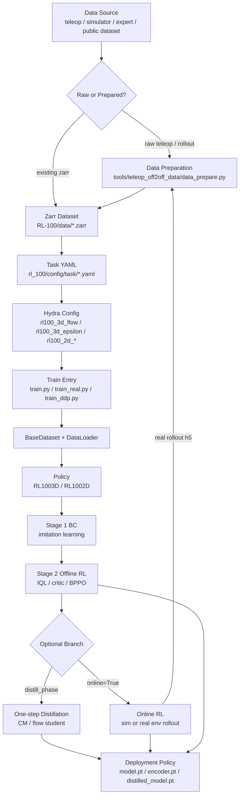
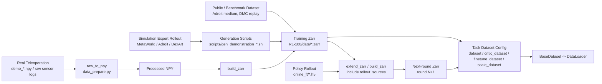
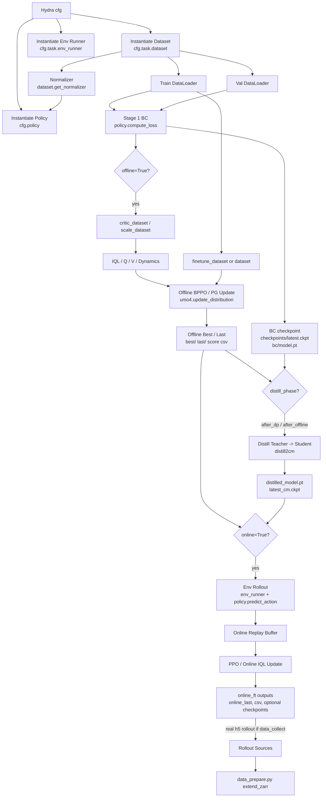

# RL-100 Project Flow

本文档梳理 RL-100 的整体执行流程，重点覆盖数据流、模型流、各阶段入口代码和主要输出位置。项目的主线是：先从离线 demonstration/rollout 数据训练 diffusion 或 flow visuomotor policy，再通过 offline RL、online RL 和 one-step distillation 做后训练与部署加速。

## 1. 总体流程

```text
teleop / simulator / expert rollout
  -> raw data or zarr dataset
  -> Hydra task config selects dataset + env_runner
  -> train.py / train_real.py / train_ddp.py
  -> BaseDataset -> DataLoader -> batch
  -> RL1002D / RL1003D policy
  -> BC pretraining
  -> optional offline RL, dynamics/IQL/value, BPPO update
  -> optional flow/CM one-step distillation
  -> optional online RL fine-tuning / real-robot collection
  -> checkpoints, policy weight folders, score csv, logs, online rollout h5/zarr
```

整体训练与数据流可以概括为：



核心入口分三层：

| 层级 | 入口 | 作用 |
| --- | --- | --- |
| Bash recipe | `scripts/Diffusion/**`, `scripts/Flow/**` | 选择算法、2D/3D、offline/online、chunk/single、DDP 等实验组合，并把参数覆盖传给 Hydra |
| Python train entry | `RL-100/train.py`, `RL-100/train_real.py`, `RL-100/train_ddp.py` | 实例化 workspace，串起数据、模型、BC、offline RL、online RL、distill、评估与保存 |
| Hydra config | `RL-100/rl_100/config/*.yaml`, `RL-100/rl_100/config/task/*.yaml` | 定义 policy、dataset、env_runner、optimizer、training、critic、ppo、dynamics 等模块 |

## 2. 目录职责

| 路径 | 职责 |
| --- | --- |
| `RL-100/train.py` | 单卡模拟训练主入口，覆盖 BC、offline RL、online RL、distill、评估和保存 |
| `RL-100/train_real.py` | 真实机器人相关入口，整体结构与 `train.py` 类似，额外支持 `data_collect`、在线 rollout 写出等真实机器人流程 |
| `RL-100/train_ddp.py` | 多卡 DDP 入口，支持 2D/3D、BC/offline/distill，在线 RL 阶段提示改用单卡入口 |
| `RL-100/rl_100/config/` | Hydra 顶层训练配置，例如 `rl100_3d_flow.yaml`、`rl100_3d_epsilon.yaml`、`rl100_2d_flow.yaml` |
| `RL-100/rl_100/config/task/` | 每个 task 的 shape、dataset zarr 路径和 env runner 配置 |
| `RL-100/rl_100/dataset/` | zarr 数据读取、sequence sampling、normalizer 和 batch 格式 |
| `RL-100/rl_100/policy/` | `RL1003D`、`RL1002D`、`LDDM` 以及 diffusion/flow policy 封装 |
| `RL-100/rl_100/model/` | 2D/3D encoder、diffusion/flow backbone、action autoencoder、通用模块 |
| `RL-100/rl_100/unidpg/` | offline/online policy-gradient、IQL/value/Q、online buffer、dynamics model |
| `RL-100/rl_100/env_runner/` | 评估和在线交互 runner，负责把 policy action 送进环境 |
| `tools/teleop_off2off_data/` | 真实机器人 teleop、raw 数据处理、zarr 构建和 offline-to-offline 数据飞轮 |

## 3. 脚本入口和配置选择

推荐先用选择器查看命令：

```bash
python scripts/select_recipe.py
```

常见 recipe：

| 场景 | 脚本 | Python 入口 |
| --- | --- | --- |
| 3D diffusion offline | `scripts/Diffusion/Offline/3D/train_policy.sh` | `python train.py --config-name=rl100_3d_epsilon.yaml ...` |
| 3D flow offline | `scripts/Flow/Offline/3D/train_policy_flow.sh` | `python train.py --config-name=rl100_3d_flow.yaml ...` |
| 2D diffusion/flow offline | `scripts/Diffusion/Offline/2D/*`, `scripts/Flow/Offline/2D/*` | `train.py` 或 `train_ddp.py`，policy target 改为 `RL1002D` |
| online RL | `scripts/Diffusion/Online/**`, `scripts/Flow/Online/**` | `train.py` / `train_real.py`，设置 `online=True` |
| one-step online distill | `scripts/Flow/Online/3D/train_policy_online_flow_distill_online.sh` | `train.py`，设置 `distill_phase='online'` |
| DDP offline/distill | `scripts/**/**/*ddp*.sh` | `torchrun ... train_ddp.py ...` |

Bash 脚本通常做这些事：

1. 选 GPU：`scripts/find_gpu.sh`。
2. 设置 EGL/MuJoCo 环境变量。
3. 进入 `RL-100/` 子目录。
4. 设置 `hydra.run.dir` 输出路径。
5. 覆盖 task、policy、scheduler、BC/offline/online/distill 和 PPO/IQL 参数。

## 4. Hydra 配置流

顶层配置以 `RL-100/rl_100/config/rl100_3d_flow.yaml` 为例：

```text
defaults:
  - task: adroit_hammer

task_name: ${task.name}
shape_meta: ${task.shape_meta}
policy: _target_=rl_100.policy.rl100_3d.RL1003D
dataloader / val_dataloader
optimizer
training
logging
checkpoint
critic
unio4
dynamics
ppo
```

task 配置以 `adroit_door_medium.yaml` 为例：

```text
shape_meta:
  obs:
    image: [3, 84, 84]
    point_cloud: [512, 3]
    agent_pos: [24]
  action: [28]

env_runner:
  _target_: rl_100.env_runner.adroit_runner.AdroitRunner

dataset:
  _target_: rl_100.dataset.adroit_dataset.AdroitDataset
  zarr_path: data/adroit_door_medium.zarr

critic_dataset / finetune_dataset / scale_dataset:
  同一数据源的不同用途版本
```

`shape_meta` 是数据和模型之间的契约：dataset 根据它提供 obs/action，policy 根据它构建 encoder 和 action head，runner 根据 task/env 参数返回相同键名的 observation。

## 5. 数据 Flow

### 5.0 数据来源和准备流程图

RL-100 训练侧统一读 zarr，但 zarr 的来源可以是公开数据、仿真 rollout、真实遥操作或真机 policy rollout。



数据准备和训练之间的关键边界是：

```text
raw files / h5 rollout / public archive
  -> zarr schema
  -> task yaml points to zarr_path
  -> training code no longer cares where the data originally came from
```

### 5.1 离线 zarr 数据

训练代码统一通过 `cfg.task.dataset` 实例化 `BaseDataset` 子类：

```text
train.py::run()
  -> hydra.utils.instantiate(cfg.task.dataset)
  -> dataset.get_shape_info(...)
  -> DataLoader(dataset, **cfg.dataloader)
  -> dataset.get_normalizer()
  -> policy.set_normalizer(normalizer)
```

典型 dataset 类：

| 数据集 | 类 | zarr 读取键 |
| --- | --- | --- |
| Adroit | `rl_100.dataset.adroit_dataset.AdroitDataset` | `state`, `action`, `point_cloud`, `img`, `next_state`, `next_action`, `next_point_cloud`, `next_img`, `reward`, `done`, `timeout`, `return` |
| MetaWorld | `rl_100.dataset.metaworld_dataset.MetaworldDataset` | 类似 Adroit，额外可能含 `full_state` |
| DexArt/DMC/real tasks | `rl_100.dataset.*_dataset.py` | 同样输出统一 batch contract |

`__getitem__` 输出格式：

```python
{
  "obs": {
    "point_cloud": Tensor[T, N, C],
    "agent_pos": Tensor[T, D_state],
    "image": Tensor[T, 3, H, W],
  },
  "next_obs": {...},
  "action": Tensor[T, D_action],
  "next_action": Tensor[T, D_action],
  "reward": Tensor[T, 1],
  "not_done": Tensor[T, 1],
  "return": Tensor[T, 1],
}
```

其中 `SequenceSampler` 根据 `horizon`、`pad_before=n_obs_steps-1`、`pad_after=n_action_steps-1` 从 episode 中切 sequence。`get_validation_dataset()` 使用同一个 replay buffer 和 val mask 生成验证集。

### 5.2 真实机器人数据准备

入口：

```bash
cd tools/teleop_off2off_data
python data_prepare.py --config configs/data_prepare.yaml
```

模式：

| 模式 | 输入 | 输出 |
| --- | --- | --- |
| `raw_to_npy` | `raw_teleop_dir/demo_*.npy` | `processed_npy_output` |
| `build_zarr` | `teleop_sources` 的 `.npy` + 可选 `rollout_sources` 的 `.h5` 目录 | 新的 `zarr_output_path` |
| `extend_zarr` | `base_zarr_path` + 一个或多个 rollout source | 新的 `zarr_output_path`，不会原地修改 base zarr |

写出的 zarr schema：

```text
data/
  point_cloud
  next_point_cloud
  state
  next_state
  action
  next_action
  reward
  return
  done
  timeout
meta/
  episode_ends
attrs:
  source_manifest
```

这正是训练 dataset 期望读取的格式。

## 6. 模型 Flow

### 6.1 Policy 实例化

`train.py` 在 workspace 初始化时执行：

```text
self.model = hydra.utils.instantiate(cfg.policy)
self.ema_model = deepcopy(self.model) if training.use_ema
self.unio4 = BehaviorProximalPolicyOptimization(policy=self.model, ...)
self.optimizer = hydra.utils.instantiate(cfg.optimizer, params=self.model.parameters())
```

3D policy：`rl_100.policy.rl100_3d.RL1003D`

```text
obs dict
  -> LinearNormalizer
  -> 3D point cloud encoder / DP3 encoder / VIB-Recon encoder
  -> obs feature
  -> diffusion or flow denoising model
  -> normalized action trajectory
  -> action normalizer unnormalize
  -> env action
```

2D policy：`rl_100.policy.rl100_2d.RL1002D`

```text
image + optional point_cloud + agent_pos
  -> ResNet / ViT / multi-image encoder
  -> obs feature
  -> diffusion or flow model
  -> action trajectory
```

调度器由 `policy.scheduler_type` 决定：

| 类型 | 关键配置 |
| --- | --- |
| Diffusion/DDIM | `policy.ddim_noise_scheduler`, `num_train_timesteps`, `num_inference_steps` |
| Consistency/CM | `policy.cm_noise_scheduler`, `distill_phase` |
| Flow | `policy.flow_noise_scheduler`, `flow_inference_steps`, `flow_sde_type`, `flow_noise_level`, `flow_distill_*` |

### 6.2 BC loss 和推理

训练 batch 进入 `policy.compute_loss(batch)`：

```text
batch["obs"] -> normalize -> encoder -> condition
batch["action"] -> action normalizer -> noisy trajectory
noisy trajectory + condition + timestep -> diffusion/flow model
model output vs target -> BC/diffusion/flow loss
optional VIB/reconstruction auxiliary loss
```

评估或在线交互进入 `policy.predict_action(obs_dict, deterministic=...)`：

```text
env obs -> normalize -> encoder -> iterative denoise or one-step distilled model
-> select action horizon
-> unnormalize
-> {"action": action}
```

## 7. 训练阶段 Flow

所有阶段都在 `TrainDP3Workspace.run()` 中串联。实际是否执行由 `offline`、`online`、`only_bc`、`distill_phase`、`training.resume/load_bc` 等配置决定。



### Stage 1: BC 初始化

入口代码：

```text
RL-100/train.py::TrainDP3Workspace.run()
RL-100/rl_100/policy/rl100_3d.py::compute_loss()
RL-100/rl_100/policy/rl100_2d.py::compute_loss()
```

流程：

```text
DataLoader batch
  -> policy.compute_loss
  -> optimizer.step
  -> EMA update
  -> val loss / env_runner eval
  -> checkpoint and best selection
```

主要输出：

| 输出 | 说明 |
| --- | --- |
| `${hydra.run.dir}/checkpoints/latest.ckpt` | workspace checkpoint，含 cfg、模型/优化器 state、epoch/global_step |
| `${hydra.run.dir}/checkpoints/epoch=...test_mean_score=...ckpt` | top-k checkpoint |
| `${hydra.run.dir}/bc/model.pt`, `encoder.pt` | 当 `only_bc=True` 时保存的 policy 权重 |
| `${hydra.run.dir}/logs.json.txt` | 训练/验证/评估日志 |

### Stage 2: Offline RL post-training

入口代码：

```text
train.py::run(), offline=True
train.py::offline_ft()
rl_100.unidpg.uni_ppo.BehaviorProximalPolicyOptimization
rl_100.unidpg.critic.IQL_Q_V_no / ValueLearner
rl_100.unidpg.dynamics_eval_batch.train_dynamics
```

流程：

```text
BC policy
  -> optional critic_dataset / scale_dataset
  -> train IQL/Q/V critic
  -> optional train dynamics model
  -> unio4.set_policy + set_old_policy
  -> BPPO / policy-gradient update on offline batches
  -> periodic env_runner.run or idql_run
  -> update global best
```

关键数据流：

```text
offline batch:
  obs, next_obs, action, reward, not_done, return
    -> critic / value / IQL advantage
    -> policy action logprob or diffusion/flow denoising logprob
    -> clipped policy-gradient objective
```

主要输出：

| 输出 | 说明 |
| --- | --- |
| `${hydra.run.dir}/best/model.pt`, `encoder.pt` | 当前全局最优 offline policy |
| `${hydra.run.dir}/best/best_score.csv`, `best_meta.txt` | 最优分数和元信息 |
| `${hydra.run.dir}/last/model.pt`, `encoder.pt` | offline 最后一次 policy |
| `${hydra.run.dir}/${timestamp}/score_${step}/...` | offline BPPO 中间最佳 |
| `${hydra.run.dir}/${timestamp}/each_scores.csv` 等 | offline 每次评估曲线 |
| `${hydra.run.dir}/${timestamp}/ratio_logs/` | ratio 统计日志，受 `ppo.enable_ratio_logging` 控制 |
| critic/dynamics 权重 | 代码会在对应阶段保存 Q/V/dynamics 相关文件 |

### Stage 3: One-step distillation

入口代码：

```text
train.py::distill2cm(...)
policy.set_target()
policy.apply_distilled_to_model()
```

触发方式：

| `distill_phase` | 含义 |
| --- | --- |
| `after_dp` | BC/DP 阶段后蒸馏 |
| `after_offline` | offline RL 之后蒸馏 |
| `online` | 在线 RL 过程中 teacher rollout + student distill 交替 |

流程：

```text
teacher policy: multi-step diffusion/flow
  -> target_model / teacher rollout
  -> student distilled_model
  -> distill loss, e.g. action_same_noise
  -> eval with use_cm=True or one-step flow inference
  -> promote/save distilled model
```

主要输出：

| 输出 | 说明 |
| --- | --- |
| `${hydra.run.dir}/best/last/distilled_model.pt` | offline/after_offline 蒸馏后的 one-step student |
| `${hydra.run.dir}/best_cm/` | CM/distill 最佳模型目录 |
| `${hydra.run.dir}/checkpoints/latest_cm.ckpt` | distill 阶段 workspace checkpoint |
| online distill 输出 | 见 Stage 4 的 `online_ft/*/distilled/update_*` |

### Stage 4: Online RL fine-tuning

入口代码：

```text
train.py::online_ft(...)
train.py::_online_ft_vec(...)
train_real.py::online_ft(...)
rl_100.unidpg.online_buffer.ReplayBuffer
rl_100.unidpg.online_buffer_vec.ReplayBuffer
```

流程：

```text
load BC/offline/best policy
  -> env_runner.make_env or make_subproc_vec_env
  -> policy.predict_action, optionally stochastic for data_collect/VIB
  -> online replay buffer
  -> optional online IQL update mixing offline batches
  -> PPO actor/critic update
  -> optional online distill update
  -> periodic eval and checkpoint
```

主要输出：

| 输出 | 说明 |
| --- | --- |
| `${hydra.run.dir}/online_ft/${timestamp}/online_last/model.pt`, `encoder.pt` | online 最终 policy |
| `${hydra.run.dir}/online_ft/${timestamp}/online_last_ema/` | online EMA policy |
| `${hydra.run.dir}/online_ft/${timestamp}/success_rates.csv`, `returns.csv` | online 评估曲线 |
| `${hydra.run.dir}/online_ft/${timestamp}/cm_success_rates.csv`, `cm_returns.csv` | online distill/CM 评估曲线 |
| `${hydra.run.dir}/online_ft/${timestamp}/policy/update_*` | 可选 online checkpoint |
| `${hydra.run.dir}/online_ft/${timestamp}/value/update_*` | value/critic checkpoint |
| `${hydra.run.dir}/online_ft/${timestamp}/iql/update_*` | online IQL checkpoint |
| `${hydra.run.dir}/online_ft/${timestamp}/distilled/update_*` | online distill student checkpoint |
| `${hydra.run.dir}/online_best_ema/` | 全局 best EMA online policy |

真实机器人采集时，`train_real.py` 还通过 `data_collect=True` 让 eval/rollout 走采集模式，生成可回灌到 `tools/teleop_off2off_data/data_prepare.py` 的 rollout `.h5` 数据。

## 8. Env Runner Flow

runner 由 `cfg.task.env_runner` 实例化：

```text
train.py::run()
  -> env_runner = hydra.utils.instantiate(cfg.task.env_runner, output_dir=self.output_dir)
```

典型 runner：

| runner | 环境 | 输出指标 |
| --- | --- | --- |
| `AdroitRunner` | `AdroitEnv` + `MujocoPointcloudWrapperAdroit` + `MultiStepWrapper` | `mean_returns`, `mean_success_rates`, `test_mean_score`, `SR_test_L3/L5` |
| `MetaworldRunner` | `MetaWorldEnv` + `MultiStepWrapper` | 同上 |
| `DexArtRunner`, `DMCRunner`, real runners | 对应环境/机器人封装 | 同一类日志字典 |

评估 flow：

```text
env.reset()
  -> obs dict with point_cloud / agent_pos / image
  -> policy.predict_action(..., deterministic=True)
  -> env.step(action)
  -> collect reward/success/video
  -> return log_data
```

在线训练 flow 会使用相同 runner 创建单环境或向量环境，但 `deterministic` 和 encoder stochastic 设置会根据 `data_collect`、`ppo.force_stochastic_online`、`distill_phase` 变化。

## 9. Checkpoint 和权重格式

项目里有两类保存格式：

### 9.1 Workspace checkpoint

由 `TrainDP3Workspace.save_checkpoint()` 写出：

```text
checkpoints/latest.ckpt
checkpoints/latest_cm.ckpt
checkpoints/epoch=0000-test_mean_score=0.000.ckpt
```

内容：

```text
cfg
state_dicts:
  model
  ema_model
  optimizer
  lr_scheduler 等
pickles:
  global_step
  epoch
  _output_dir
```

适合恢复训练。

### 9.2 Policy 权重目录

由 `RL1003D.save()` / `RL1002D.save()` 写出：

```text
model.pt
encoder.pt
distilled_model.pt      # 如果存在
target_model.pt         # 如果存在
```

`unio4.save(path)` 最终也保存这一套 policy 权重。适合部署、offline/online 阶段之间加载、数据采集和 best policy 管理。

## 10. 端到端示例

### 3D Flow Offline

```bash
bash scripts/Flow/Offline/3D/train_policy_flow.sh rl100 adroit_door_medium 0112 100
```

主要 flow：

```text
script
  -> train.py --config-name=rl100_3d_flow.yaml task=adroit_door_medium offline=True only_bc=True ...
  -> AdroitDataset(data/adroit_door_medium.zarr)
  -> RL1003D(scheduler_type=flow)
  -> BC + offline RL/BPPO
  -> output under data/outputs_flow/...
```

### 3D Flow Online Distill

```bash
bash scripts/Flow/Online/3D/train_policy_online_flow_distill_online.sh rl100 adroit_door_medium 0112 100 16
```

主要 flow：

```text
script
  -> train.py --config-name=rl100_3d_flow.yaml online=True distill_phase=online
  -> load offline best / offline distilled if needed
  -> AdroitRunner vec env rollout
  -> online PPO update
  -> one-step student distill update
  -> online_ft/${timestamp}/ outputs
```

### 真实机器人离线数据飞轮

```bash
cd tools/teleop_off2off_data
python data_prepare.py --config configs/data_prepare.yaml --mode raw_to_npy
python data_prepare.py --config configs/data_prepare.yaml --mode build_zarr --include-rollouts
```

然后把 task yaml 的 `dataset.zarr_path` 指向新 zarr，运行对应 offline recipe。采集新 rollout 后，把 `.h5` 目录加入 `rollout_sources`，再用 `extend_zarr` 生成下一轮 zarr。

## 11. 调试和追代码建议

从一个实验命令反查代码时，按这个顺序最省力：

1. 看 bash recipe 里传了哪个 `--config-name`、`task`、`policy._target_`、`offline/online/distill_phase`。
2. 看 `RL-100/rl_100/config/<config>.yaml` 的 `policy`、`training`、`critic`、`unio4`、`ppo`。
3. 看 `RL-100/rl_100/config/task/<task>.yaml` 的 `dataset.zarr_path`、`shape_meta`、`env_runner`。
4. 看 dataset 类的 `_sample_to_data()`，确认 batch 键名和 shape。
5. 看 `RL1002D/RL1003D.compute_loss()` 和 `predict_action()`，确认模型训练和推理路径。
6. 看 `train.py::run()` 中 `offline`、`online`、`distill_phase` 分支，确认当前实验到底跑了哪些 stage。
7. 看输出目录下的 `config.txt`、`logs.json.txt`、`best_meta.txt` 和 csv 曲线，确认实际配置和模型选择。
