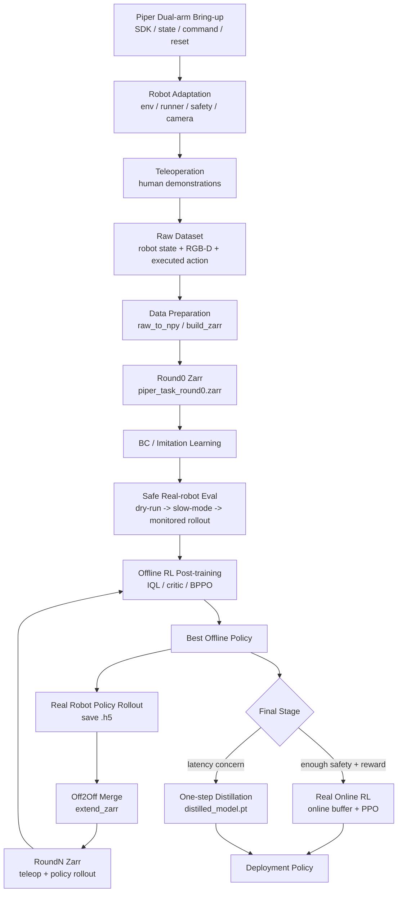

# Reproduction Plan: Piper Dual-arm Real Robot

本文档给出一个基于 Piper 双臂机械臂复现 RL-100 的计划。目标是从遥操作采集真实数据开始，完成机器人本体适配、BC 初始化、offline RL 数据飞轮，最后进入真机 online RL 或真机 rollout 后训练。

相关背景文档：

```text
docs/project_flow.md
docs/dataset_guide.md
docs/robot_adaptation.md
```

## 1. 目标范围

目标主线：

```text
Piper 双臂本体适配
  -> 遥操作采集 demonstration
  -> raw 数据转换 zarr
  -> BC / imitation learning
  -> offline RL post-training
  -> 真机 rollout 采集
  -> off2off 合并新数据
  -> 下一轮 offline RL
  -> 最后可选真机 online RL
  -> 可选 one-step distillation 部署
```

这个路线需要真机、相机、遥操作设备和安全机制。它不是纯粹跑现成脚本，需要补机器人接口、数据格式和任务配置。

整体复现闭环：



本体适配子流程：

```mermaid
flowchart LR
    A[Define Task] --> B[Action Contract<br/>dual-arm action dim / scale / frame]
    B --> C[Observation Contract<br/>agent_pos / image / point_cloud]
    C --> D[Camera Calibration<br/>intrinsics / extrinsics / point cloud crop]
    D --> E[Safety Wrapper<br/>bounds / velocity / collision / watchdog]
    E --> F[Piper Env<br/>reset / step / get_obs]
    F --> G[Piper Runner<br/>eval + rollout logging]
    G --> H[Task YAML<br/>shape_meta + dataset + env_runner]
    H --> I[Training Entry<br/>train.py / train_real.py]
```



## 2. 前置假设

需要先明确 Piper 双臂系统的这些信息：

| 项 | 需要确认 |
| --- | --- |
| 机器人 SDK | Piper 控制接口、状态读取接口、频率、通信方式 |
| 双臂结构 | 左右臂 DOF、是否有夹爪、夹爪控制方式 |
| 控制模式 | joint position、joint velocity、末端 delta pose、Cartesian control |
| 遥操作设备 | 键盘、手柄、spacemouse、VR、主从设备 |
| 相机 | RealSense 或其他 RGB-D，相机数量和安装位置 |
| 坐标系 | base/world/camera/tool frame 定义 |
| 任务 | 双臂协作具体任务，例如搬运、递交、开合、整理、装配 |
| 成功判定 | 规则、视觉检测、人工按钮或后处理标注 |

## 3. 环境配置

Piper 双臂路线的环境分三层：RL-100 训练环境、真实机器人/相机运行环境、Piper 本体 SDK 和安全运行时。不要只按纯仿真环境配置，否则后续 teleop、相机、真机 rollout 会缺依赖或缺接口。

### 3.1 RL-100 基础训练环境

普通新机器建议从零创建环境：

```bash
conda create -n rl100 python=3.8 -y
conda activate rl100

python -m pip install "setuptools==59.5.0" wheel
python -m pip install torch==2.4.0 torchvision==0.19.0 torchaudio==2.4.0 --index-url https://download.pytorch.org/whl/cu121
```

`conda create -n rl100 --clone dp3 -y` 只适用于本机已有 `dp3` 环境的情况；`dp3` 不是公开环境。

安装基础 Python 依赖：

```bash
python -m pip install \
  zarr==2.12.0 wandb==0.20.1 ipdb==0.13.13 gpustat==1.1.1 \
  dm_control==1.0.23 omegaconf==2.3.0 hydra-core==1.2.0 dill==0.3.5.1 \
  einops==0.8.1 diffusers==0.33.1 huggingface_hub==0.33.1 numba==0.56.4 \
  moviepy==1.0.3 imageio==2.35.1 av==12.3.0 matplotlib==3.7.5 termcolor==2.4.0 \
  open3d==0.19.0 opencv-python==4.11.0.86 scipy==1.10.1 scikit-learn==1.3.2 \
  scikit-image==0.21.0 pandas==2.0.3 h5py==3.11.0 trimesh==4.6.12 \
  pybullet==3.2.7 plyfile==1.0.3 transforms3d==0.4.2 shapely==2.0.7 rtree==1.3.0 \
  tensorboardx==2.6.2.2 tqdm==4.67.1 colorlog==6.9.0 tabulate==0.9.0 \
  gdown==5.2.0 ftfy==6.2.3 regex==2024.11.6 yacs==0.1.8 \
  fvcore==0.1.5.post20221221 iopath==0.1.10 blessed==1.21.0 wcwidth==0.2.13 \
  timm==1.0.26 transformers==4.40.0
```

如果你已有环境并且不想改动已安装包版本，只补缺失包即可；可使用 `pip install --no-deps` 避免自动升级已有依赖。

### 3.2 运行时路径

从仓库根目录设置：

```bash
conda activate rl100

export REPO_ROOT=$(pwd)
export PYTHONPATH=${REPO_ROOT}/RL-100:${PYTHONPATH}
```

Piper 真机路线不强依赖 MuJoCo。MuJoCo 主要用于先跑 Adroit/MetaWorld 这类仿真 smoke test，验证 RL-100 训练环境。如果你的机器是 ARM 架构，例如：

```bash
uname -m
```

输出为：

```text
aarch64
arm64
```

不要使用 `mujoco210-linux-x86_64.tar.gz`，那是 x86_64 二进制包。ARM 上可以先跳过 MuJoCo 仿真 smoke test，优先验证：

```text
Python import
zarr dataset
policy forward / compute_loss
Piper SDK dry-run
RealSense / point cloud
```

如果仍希望在 ARM 上跑 MuJoCo 相关仿真，优先尝试现代 Python binding：

```bash
python -m pip install mujoco dm_control
python -c "import mujoco; print('mujoco import ok')"
python -c "import dm_control; print('dm_control import ok')"
```

但本仓库部分仿真路径仍依赖 legacy `mujoco-py-2.1.2.14`，ARM 上可能需要额外适配。Piper 真机复现不应把这一步作为硬性前置。

### 3.3 仓库内依赖

安装 third-party editable packages：

```bash
python -m pip install -e third_party/dexart-release
python -m pip install -e third_party/gym-0.21.0
python -m pip install -e third_party/Metaworld
python -m pip install -e third_party/rrl-dependencies/mj_envs/.
python -m pip install -e third_party/rrl-dependencies/mjrl/.
python -m pip install -e third_party/mujoco-py-2.1.2.14
python -m pip install -e third_party/pytorch3d_simplified
python -m pip install -e visualizer
```

ARM 注意：`third_party/mujoco-py-2.1.2.14` 可能无法直接安装。如果你的目标是 Piper 真机路线，可以先跳过这项，先完成 RL-100 基础 import、Piper SDK、相机、数据采集和 BC 训练。只有要跑 Adroit/MetaWorld 仿真 eval 时，才必须解决 MuJoCo/mujoco-py 兼容问题。

检查路径：

```bash
python -m pip show dexart gym metaworld mj-envs mjrl mujoco-py pytorch3d visualizer r3m
```

### 3.4 真实机器人和相机依赖

Piper 真机路线通常还需要：

```bash
python -m pip install \
  pyrealsense2 \
  ur_rtde==1.6.1 atomics==1.0.3 viser==0.2.23 \
  dt_apriltags fpsample zerorpc \
  yapf==0.43.0 littleutils==0.2.4 sorcery==0.2.2 wrapt==1.17.2
```

其中 `ur_rtde` 对 Piper 不一定需要；它是仓库已有真实机器人工具链的依赖。Piper 本体还需要你按厂商/社区文档安装对应 SDK，例如 Python API、ROS/ROS2 driver、CAN/串口库或厂商控制库。该部分应在接入时明确写入：

```text
Piper SDK package name
通信方式：CAN / USB / Ethernet / serial
控制频率
状态反馈 API
命令下发 API
急停或 disable torque API
```

建议把 Piper SDK 封装在：

```text
tools/teleop_off2off_data/piper_wrapper.py
RL-100/rl_100/env/piper/piper_wrapper.py
```

### 3.5 系统和设备权限

真机运行前需要确认：

```text
相机设备权限，例如 /dev/video* 或 RealSense udev rules
Piper 通信设备权限，例如 /dev/ttyUSB*、CAN interface 或网络 IP
GPU/NVIDIA 驱动可用
急停硬件可用
控制主机时间同步稳定
```

如果使用 RealSense，建议先独立验证：

```bash
python -c "import pyrealsense2 as rs; print('realsense import ok')"
```

如果使用 Open3D 点云处理：

```bash
python -c "import open3d as o3d; print(o3d.__version__)"
```

### 3.6 Piper 路线 sanity checks

按顺序检查：

```bash
python -c "import torch; print(torch.__version__, torch.cuda.is_available())"
python -c "import rl_100, zarr, hydra, einops; print('rl100 imports ok')"
python -c "import open3d as o3d; print('open3d', o3d.__version__)"
python -c "import pyrealsense2 as rs; print('realsense import ok')"
```

然后做硬件级 dry-run：

```text
1. 只读 Piper 左右臂状态，不发动作
2. 只读相机 RGB-D，不控制机器人
3. 生成点云并可视化坐标系
4. 发送极小幅度安全动作
5. 测试急停 / disable torque / watchdog
```

只有这些通过后，才进入 teleop 数据采集。

## 4. 项目中需要新增或修改的模块

建议新增：

```text
RL-100/rl_100/env/piper/
  piper_env.py
  piper_wrapper.py
  piper_dual_arm_env.py
  realsense.py
  reward.py
  safety.py

RL-100/rl_100/env_runner/piper_runner.py
RL-100/rl_100/dataset/piper_dataset.py
RL-100/rl_100/config/task/piper_<task>.yaml
tools/teleop_off2off_data/piper_wrapper.py
tools/teleop_off2off_data/teleop_piper.py
```

可以参考：

```text
RL-100/rl_100/env/franka/
RL-100/rl_100/env/ur5/
RL-100/rl_100/env/r1/
tools/teleop_off2off_data/franka_wrapper.py
tools/teleop_off2off_data/xarm_wrapper.py
tools/teleop_off2off_data/data_prepare.py
```

## 5. 双臂 Action 设计

必须先定 action contract。建议从简单、安全、可控的末端增量控制开始。

一个常见双臂 action 设计：

```text
left_arm:
  dx, dy, dz, droll, dpitch, dyaw, gripper
right_arm:
  dx, dy, dz, droll, dpitch, dyaw, gripper

action_dim = 14
```

如果不用末端旋转，可先简化：

```text
left_arm:
  dx, dy, dz, gripper
right_arm:
  dx, dy, dz, gripper

action_dim = 8
```

需要明确：

| 项 | 建议 |
| --- | --- |
| action 坐标系 | 优先 robot base/world frame，避免 camera frame 漂移 |
| action 单位 | 平移用米，旋转用弧度，夹爪用归一化或开合宽度 |
| action scale | 每步最大平移和旋转必须限幅 |
| 控制频率 | 从低频开始，例如 5-10 Hz |
| chunk action | 第一版建议 `n_action_steps=1`，跑通后再试 chunk |
| 双臂同步 | 同一 control tick 同步下发左右臂命令 |
| 安全裁剪 | 每条 action 进入 robot SDK 前都要过 safety wrapper |

## 6. Observation 设计

建议第一版 observation：

```python
obs = {
    "point_cloud": task_space_point_cloud,
    "image": rgb_image,
    "agent_pos": proprioception,
}
```

双臂 `agent_pos` 可以包含：

```text
left_joint_pos
right_joint_pos
left_ee_pose
right_ee_pose
left_gripper_state
right_gripper_state
```

建议记录全量 raw state，但训练用 `agent_pos` 可以先压缩：

```text
left_ee_xyzrpy + left_gripper
right_ee_xyzrpy + right_gripper
optional joint_pos
```

相机方案：

| 方案 | 优点 | 风险 |
| --- | --- | --- |
| 单 RGB-D 相机 | 简单，容易先跑通 | 双臂遮挡明显 |
| 双视角 RGB-D | 覆盖更好 | 数据和模型配置更复杂 |
| 外部相机 + wrist camera | 操作细节好 | 同步和标定更复杂 |

第一版建议：

```text
1 个外部 RGB-D 相机
point_cloud 下采样到 512 或 1024 点
image resize 到 [3, 84, 84]
```

## 7. 安全适配

真机 RL 前必须完成安全层，不建议直接让 policy 输出裸动作。

必须实现：

| 安全项 | 要求 |
| --- | --- |
| workspace bounds | 左右臂末端 xyz 限制 |
| per-step delta limit | 每步最大位移/旋转限制 |
| joint limits | SDK 层和 wrapper 层双重限制 |
| velocity limits | 低速开始 |
| dual-arm collision guard | 左右臂、夹爪、桌面、物体安全距离 |
| emergency stop | 硬件急停和软件急停 |
| watchdog | 控制循环超时自动停机 |
| reset safety | reset 走预设安全轨迹 |
| dry-run mode | 只打印动作，不下发 |
| slow mode | 首次 policy 执行时低频低幅度 |

建议新增：

```text
RL-100/rl_100/env/piper/safety.py
```

所有 `env.step(action)` 都先经过：

```text
policy action
  -> unnormalize
  -> scale
  -> safety clip
  -> collision/workspace check
  -> robot command
```

## 8. 数据采集计划

### 7.1 遥操作 demonstration

第一批数据用于 BC 初始化。建议采集：

```text
smoke test: 5-10 条成功 episode
BC baseline: 50-200 条高质量成功 episode
offline RL 初版: 成功 + 部分失败/恢复 trajectory
```

每一帧 raw 数据建议记录：

```text
timestamp
left_arm_state
right_arm_state
left_ee_pose
right_ee_pose
left_gripper_state
right_gripper_state
rgb
depth
camera_intrinsics
camera_extrinsics_version
teleop_command
executed_action
reward
done
timeout
is_success
```

关键点：训练里的 `action` 应该是实际下发并执行的 action，而不是遥操作设备的原始输入。

### 7.2 失败和恢复数据

BC 可以先用成功数据，但 offline RL 和真机 robust policy 需要更多状态覆盖。

建议收集：

```text
成功轨迹
轻微偏差后的恢复轨迹
失败轨迹，标注 done/reward
接近边界但安全的状态
不同物体初始位置
不同光照/遮挡情况
```

### 7.3 真机 policy rollout 数据

BC/offline policy 有初步成功率后，再采集 policy rollout：

```text
offline policy
  -> true robot rollout
  -> save .h5 episodes
  -> data_prepare.py extend_zarr
  -> next-round zarr
```

policy rollout 时建议：

```text
先 deterministic eval
再小幅 stochastic data_collect
每次只采少量 episode
人工监控急停
失败原因单独记录
```

## 9. zarr 数据结构

最终训练 zarr 需要满足：

```text
data/
  point_cloud
  next_point_cloud
  state
  next_state
  action
  next_action
  reward
  return
  done
  timeout
  img
  next_img

meta/
  episode_ends
```

其中：

```text
state = agent_pos
action = 双臂动作向量
point_cloud = 任务空间点云
img = RGB 图像
```

如果第一版只跑 3D policy，也建议保留 `img/next_img`，以后切 2D policy 会省很多麻烦。

## 10. Piper Dataset 类

如果 zarr schema 和 Adroit/MetaWorld 基本一致，可以先仿照 `AdroitDataset` 写：

```text
RL-100/rl_100/dataset/piper_dataset.py
```

需要实现：

```python
class PiperDataset(BaseDataset):
    def __init__(...)
    def get_validation_dataset(...)
    def get_normalizer(...)
    def get_shape_info(...)
    def __len__(...)
    def __getitem__(...)
```

输出 batch：

```python
{
  "obs": {
    "point_cloud": point_cloud,
    "agent_pos": state,
    "image": img,
  },
  "next_obs": {
    "point_cloud": next_point_cloud,
    "agent_pos": next_state,
    "image": next_img,
  },
  "reward": reward,
  "not_done": 1 - done,
  "return": return,
  "action": action,
  "next_action": next_action,
}
```

## 11. Piper Env 和 Runner

### 10.1 Env

新增：

```text
RL-100/rl_100/env/piper/piper_dual_arm_env.py
```

接口：

```python
class PiperDualArmEnv:
    def reset(self):
        ...

    def step(self, action):
        ...

    def get_obs(self):
        ...

    def close(self):
        ...
```

`step(action)` 内部流程：

```text
action
  -> split left/right
  -> denormalize/scale if needed
  -> safety check
  -> send command to Piper SDK
  -> wait control dt
  -> read robot state and camera
  -> compute reward/success/done
  -> return obs, reward, done, info
```

### 10.2 Runner

新增：

```text
RL-100/rl_100/env_runner/piper_runner.py
```

参考：

```text
RL-100/rl_100/env_runner/adroit_runner.py
RL-100/rl_100/env_runner/metaworld_runner.py
```

返回指标：

```python
{
    "mean_returns": ...,
    "mean_success_rates": ...,
    "test_mean_score": ...,
}
```

`test_mean_score` 用于保存 best checkpoint。

## 12. Task YAML

新增：

```text
RL-100/rl_100/config/task/piper_<task>.yaml
```

模板：

```yaml
name: piper_dual_arm_<task>
task_name: <task>

shape_meta:
  obs:
    image:
      shape: [3, 84, 84]
      type: rgb
    point_cloud:
      shape: [512, 3]
      type: point_cloud
    agent_pos:
      shape: [D_STATE]
      type: low_dim
  action:
    shape: [D_ACTION]

env_runner:
  _target_: rl_100.env_runner.piper_runner.PiperRunner
  eval_episodes: 5
  max_steps: 200
  n_obs_steps: ${n_obs_steps}
  n_action_steps: ${n_action_steps}
  fps: 5
  env_num: 1

dataset:
  _target_: rl_100.dataset.piper_dataset.PiperDataset
  zarr_path: data/piper_<task>_round0.zarr
  horizon: ${horizon}
  pad_before: ${eval:'${n_obs_steps}-1'}
  pad_after: ${eval:'${n_action_steps}-1'}
  seed: 42
  val_ratio: 0.02

critic_dataset:
  _target_: rl_100.dataset.piper_dataset.PiperDataset
  zarr_path: data/piper_<task>_round0.zarr
  horizon: ${horizon}
  pad_before: ${eval:'${n_obs_steps}-1'}
  pad_after: ${eval:'${n_action_steps}-1'}
  seed: 42
  val_ratio: 0.0

finetune_dataset:
  _target_: rl_100.dataset.piper_dataset.PiperDataset
  zarr_path: data/piper_<task>_round0.zarr
  horizon: ${horizon}
  pad_before: ${eval:'${n_obs_steps}-1'}
  pad_after: ${eval:'${n_action_steps}-1'}
  seed: 42
  val_ratio: 0.0

scale_dataset:
  _target_: rl_100.dataset.piper_dataset.PiperDataset
  zarr_path: data/piper_<task>_round0.zarr
  horizon: ${horizon}
  pad_before: ${eval:'${n_obs_steps}-1'}
  pad_after: ${eval:'${n_action_steps}-1'}
  seed: 42
  val_ratio: 0.0
  scale_strategy: dynamic
```

第一版建议：

```text
n_action_steps=1
n_obs_steps=2 或 3
horizon=3
fps=5
eval_episodes=3-5
```

## 13. 训练计划

### Stage A: 本体和相机 bring-up

目标：

```text
机器人能安全 reset
能读左右臂状态
能发小幅动作
能采 RGB-D
能生成 point_cloud
```

验收标准：

```text
dry-run 不发动作
slow-mode 小动作安全执行
obs shape 稳定
相机点云在 robot base/world frame 下合理
```

### Stage B: 遥操作采集和 zarr 构建

目标：

```text
采集 5-10 条 smoke test demonstration
转成 piper_<task>_round0.zarr
```

流程：

```text
teleop_piper.py
  -> raw demo files
  -> data_prepare.py 或 piper_data_prepare.py
  -> zarr
```

验收标准：

```text
PiperDataset 能读 batch
shape_meta 对齐
action/state 无异常值
episode_ends 正确
```

### Stage C: BC smoke test

目标：先不做真机 online RL，只做 imitation learning。

建议从 3D flow 或 diffusion 单卡开始：

```bash
cd RL-100
python train.py --config-name=rl100_3d_flow.yaml \
  task=piper_<task> \
  training.device="cuda:0" \
  horizon=3 \
  n_obs_steps=3 \
  n_action_steps=1 \
  task.env_runner.eval_episodes=3 \
  task.env_runner.env_num=1 \
  offline=False \
  online=False \
  only_bc=True \
  logging.mode=offline
```

实际参数需要结合 `train.py` 分支再收紧，目标是先让 `compute_loss()`、checkpoint、少量 eval 跑通。

验收标准：

```text
BC loss 下降
policy.predict_action 输出 action_dim 正确
真机 dry-run 输出合理
```

### Stage D: 真机安全评估

目标：让 BC policy 在真机上以低风险方式执行。

流程：

```text
load bc policy
  -> dry-run
  -> slow-mode
  -> low action scale
  -> 3-5 个 eval episodes
```

必须开启：

```text
workspace bounds
delta clipping
watchdog
急停
人工监控
```

验收标准：

```text
能完整执行 episode
没有超限动作
能正确记录 success/failure
能保存 rollout .h5
```

### Stage E: Offline RL

目标：用真实 teleop 数据做 offline RL 后训练。

数据：

```text
piper_<task>_round0.zarr
```

建议先只跑很短的 offline step，确认 critic/IQL/value shape 都对。

验收标准：

```text
offline RL 能运行
best/model.pt 和 best/encoder.pt 生成
test_mean_score 记录正常
```

### Stage F: Off2Off 迭代

目标：用当前 policy 在真机上采集 rollout，合并成下一轮数据。

流程：

```text
offline policy best
  -> 真机 rollout
  -> save .h5
  -> add rollout_sources in data_prepare.yaml
  -> extend_zarr
  -> piper_<task>_round1.zarr
  -> offline RL round1
```

数据合并参考：

```bash
python data_prepare.py \
  --config configs/data_prepare.yaml \
  --mode extend_zarr \
  --rollout-source piper_round1 \
  --base-zarr-path /path/to/piper_<task>_round0.zarr \
  --zarr-output-path /path/to/piper_<task>_round1.zarr
```

验收标准：

```text
new zarr source_manifest 记录新 rollout
round1 dataset 能训练
成功率或恢复能力不下降
```

### Stage G: 真机 Online RL

目标：在已经安全且有一定成功率的 policy 基础上，进行短周期真机 online RL。

前置条件：

```text
BC/offline policy 已能安全执行
reward/success 自动或半自动标注可靠
safety wrapper 稳定
rollout 保存和恢复机制稳定
```

建议设置：

```text
env_num=1
eval_episodes=少量
ppo.max_train_steps 从很小开始
action scale 小
data_collect=False, 真正 online RL 时不要误写采集模式
```

验收标准：

```text
online_ft/<timestamp>/online_last 生成
returns/success_rates csv 生成
真机无安全事故
性能不明显退化
```

### Stage H: Distillation 部署

目标：如果 diffusion/flow 多步推理太慢，做 one-step distillation。

选择：

```text
after_offline distill
或 online distill
```

验收标准：

```text
distilled_model.pt 生成
真机推理延迟下降
成功率保持在可接受范围
```

## 14. 数据版本规划

建议命名：

```text
data/piper_<task>_round0_teleop.zarr
data/piper_<task>_round1_policy.zarr
data/piper_<task>_round2_policy.zarr
```

rollout 原始数据：

```text
data/piper_rollouts/<task>/round1/
data/piper_rollouts/<task>/round2/
```

每轮保存：

```text
source_manifest
采集日期
policy checkpoint id
成功率
失败原因统计
相机标定版本
机器人配置版本
```

## 15. 关键风险

| 风险 | 应对 |
| --- | --- |
| action 定义错 | 先 dry-run，再低速小幅动作 |
| 双臂碰撞 | collision guard + workspace 分区 |
| 相机外参错 | 可视化点云和 robot base 对齐 |
| teleop action 和 executed action 不一致 | 训练保存 executed action |
| reward 标注不稳定 | 先人工审核一批，再自动化 |
| offline RL policy 退化 | 保留 BC checkpoint，逐步评估 |
| online RL 探索危险 | 小步长、低频、人工监控、严格 clip |
| 数据分布不够 | off2off 多轮补充失败/恢复数据 |

## 16. 最小可行里程碑

| 里程碑 | 结果 |
| --- | --- |
| M1 | Piper env 能 reset/step/get_obs |
| M2 | teleop 能采 5-10 条 episode |
| M3 | zarr 能被 `PiperDataset` 读取 |
| M4 | BC loss 能下降 |
| M5 | BC policy 真机 slow-mode 能安全执行 |
| M6 | offline RL 生成 best policy |
| M7 | policy rollout 能保存 `.h5` |
| M8 | `extend_zarr` 生成 round1 数据 |
| M9 | round1 offline RL 后成功率提升 |
| M10 | 小规模真机 online RL 跑通 |

## 17. 建议先做和暂缓做

先做：

```text
单任务
单 RGB-D 相机
3D point cloud policy
n_action_steps=1
低频控制
BC + offline RL
off2off 数据飞轮
```

暂缓：

```text
多任务联合训练
多视角复杂融合
高频 chunk control
大规模真机 online RL
无人工监控探索
从零开始随机探索
```

最小正确路线是：先把 Piper 双臂作为一个新的 `task + dataset + env_runner` 接入 RL-100，然后用遥操作数据完成 BC，再通过真实 rollout 数据飞轮逐步进入 offline RL 和 online RL。
