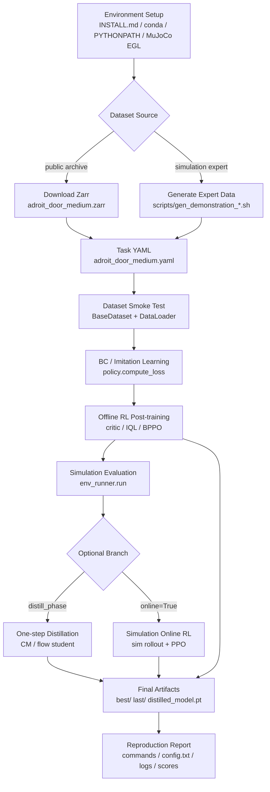
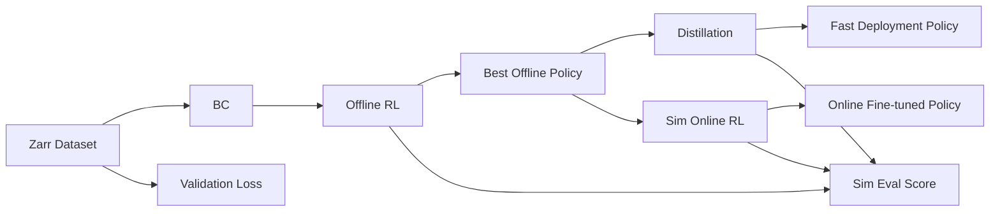

# Reproduction Plan: Simulation and Public Datasets

本文档给出一个不依赖真机、不需要自己采集真实数据的 RL-100 复现计划。目标是先用公开/已发布 zarr 数据集和仿真环境，把 BC、offline RL、distillation、可选 sim online RL 的主链路跑通。

相关背景文档：

```text
docs/project_flow.md
docs/dataset_guide.md
```

## 1. 目标范围

本计划优先复现：

```text
公开/benchmark zarr dataset
  -> BC / imitation learning
  -> offline RL post-training
  -> simulation evaluation
  -> optional one-step distillation
  -> optional simulation online RL
```

不覆盖：

```text
真实机器人 teleop
真实机器人数据采集
真实机器人 online RL
真实机器人安全控制
```

整体复现流程图：



阶段依赖图：



## 2. 推荐任务选择

优先级建议：

| 优先级 | 任务 | 原因 |
| --- | --- | --- |
| P0 | `adroit_door_medium` | README 推荐 smoke test，数据下载路径明确 |
| P1 | `adroit_door` / `adroit_hammer` / `adroit_pen` | 可用 expert checkpoint 生成仿真 expert 数据 |
| P1 | MetaWorld 单任务，如 `metaworld_assembly` | 仿真任务多，适合验证泛化到不同任务配置 |
| P2 | DexArt laptop/faucet/bucket/toilet | 依赖 DexArt assets 和 checkpoint，环境准备更重 |
| P2 | DMC cheetah/walker/cartpole | 更偏算法 benchmark，不是机器人操作主线 |

第一轮建议只跑：

```text
adroit_door_medium
```

## 3. 环境配置

完整安装细节见 [`INSTALL.md`](../INSTALL.md)。这里给出复现纯仿真/公开数据集路线时更具体的环境配置清单。

### 3.1 安装方式选择

不要把下面这条命令理解成通用安装方式：

```bash
conda create -n rl100 --clone dp3 -y
```

它只适用于本机已经存在 `dp3` conda 环境的情况。`dp3` 不是公开环境，也不会从网络下载。普通新机器应使用从零安装方式：

```bash
conda create -n rl100 python=3.8 -y
conda activate rl100

python -m pip install "setuptools==59.5.0" wheel
python -m pip install torch==2.4.0 torchvision==0.19.0 torchaudio==2.4.0 --index-url https://download.pytorch.org/whl/cu121
```

然后安装 RL-100 的 Python 依赖：

```bash
python -m pip install \
  zarr==2.12.0 wandb==0.20.1 ipdb==0.13.13 gpustat==1.1.1 \
  dm_control==1.0.23 omegaconf==2.3.0 hydra-core==1.2.0 dill==0.3.5.1 \
  einops==0.8.1 diffusers==0.33.1 huggingface_hub==0.33.1 numba==0.56.4 \
  moviepy==1.0.3 imageio==2.35.1 av==12.3.0 matplotlib==3.7.5 termcolor==2.4.0 \
  open3d==0.19.0 opencv-python==4.11.0.86 scipy==1.10.1 scikit-learn==1.3.2 \
  scikit-image==0.21.0 pandas==2.0.3 h5py==3.11.0 trimesh==4.6.12 \
  pybullet==3.2.7 plyfile==1.0.3 transforms3d==0.4.2 shapely==2.0.7 rtree==1.3.0 \
  tensorboardx==2.6.2.2 tqdm==4.67.1 colorlog==6.9.0 tabulate==0.9.0 \
  gdown==5.2.0 ftfy==6.2.3 regex==2024.11.6 yacs==0.1.8 \
  fvcore==0.1.5.post20221221 iopath==0.1.10 blessed==1.21.0 wcwidth==0.2.13 \
  timm==1.0.26 transformers==4.40.0
```

如果你已经有自己的环境，不希望更新已有包，可以先检查缺失项，只对缺失包执行 `pip install --no-deps ...`。不要直接整条覆盖安装，以免升级/降级已有依赖。

### 3.2 运行时路径

从仓库根目录设置：

```bash
conda activate rl100

export REPO_ROOT=$(pwd)
export PYTHONPATH=${REPO_ROOT}/RL-100:${PYTHONPATH}
export MUJOCO_GL=egl
export PYOPENGL_PLATFORM=egl
```

`RL-100/` 不是 pip installable package，因此必须通过 `PYTHONPATH` 导入。

### 3.3 MuJoCo 和系统依赖

Adroit、MetaWorld、DMC 等仿真任务依赖 MuJoCo/EGL。这里要先区分机器架构：

```bash
uname -m
```

如果输出是：

```text
x86_64
```

才适合使用 legacy MuJoCo 2.1 的 x86_64 包：

```bash
mkdir -p ~/.mujoco
cd ~/.mujoco
wget https://github.com/deepmind/mujoco/releases/download/2.1.0/mujoco210-linux-x86_64.tar.gz -O mujoco210.tar.gz --no-check-certificate
tar -xvzf mujoco210.tar.gz
```

并设置：

```bash
export LD_LIBRARY_PATH=${HOME}/.mujoco/mujoco210/bin:/usr/lib/nvidia:/usr/local/cuda/lib64:${LD_LIBRARY_PATH}
export MUJOCO_GL=egl
export PYOPENGL_PLATFORM=egl
```

如果输出是：

```text
aarch64
arm64
```

不要照抄 `mujoco210-linux-x86_64.tar.gz`。这是 x86_64 二进制包，ARM 机器无法直接使用。ARM 上建议优先走现代 Python binding 路线：

```bash
python -m pip install mujoco dm_control
```

然后检查：

```bash
python -c "import mujoco; print('mujoco import ok')"
python -c "import dm_control; print('dm_control import ok')"
```

需要注意：本仓库里部分 legacy 依赖仍指向 `mujoco-py-2.1.2.14` 和旧版 MuJoCo 2.1，这条路线在 ARM 上可能没有可直接使用的 wheel 或需要额外编译。若 ARM 上 `mujoco-py` 不可用，纯仿真复现的 Adroit/MetaWorld 路线可能需要：

```text
1. 使用 x86_64 Linux 机器跑仿真 smoke test
2. 或改造环境依赖，把旧 mujoco-py 路径迁移到官方 mujoco Python binding
3. 或先跳过 MuJoCo 仿真 eval，只验证 dataset -> policy -> loss/checkpoint 流程
```

干净 Ubuntu 机器上通常还需要：

```bash
sudo apt-get update
sudo apt-get install -y libglew-dev libgl1-mesa-dev libosmesa6-dev libglfw3 libglfw3-dev patchelf ninja-build
```

### 3.4 仓库内 third_party editable 依赖

从仓库根目录安装：

```bash
python -m pip install -e third_party/dexart-release
python -m pip install -e third_party/gym-0.21.0
python -m pip install -e third_party/Metaworld
python -m pip install -e third_party/rrl-dependencies/mj_envs/.
python -m pip install -e third_party/rrl-dependencies/mjrl/.
python -m pip install -e third_party/mujoco-py-2.1.2.14
python -m pip install -e third_party/pytorch3d_simplified
python -m pip install -e visualizer
```

ARM 注意：`third_party/mujoco-py-2.1.2.14` 是最容易出问题的一项。如果只想先跑数据集读取、BC forward、loss/checkpoint，不需要立即安装成功 `mujoco-py`；但要跑 Adroit/MetaWorld 仿真 eval，仍需要解决 MuJoCo 运行时兼容问题。

不要运行：

```bash
python -m pip install -e RL-100
```

因为本项目通过 `PYTHONPATH` 导入 `RL-100/rl_100`。

### 3.5 Assets 和数据

按任务确认这些路径：

```text
RL-100/data/adroit_door_medium.zarr      # smoke-test 数据
third_party/VRL3/ckpts                   # Adroit expert 数据生成需要
third_party/dexart-release/assets        # DexArt 任务需要
```

第一轮只跑 `adroit_door_medium` 时，重点确认：

```text
RL-100/data/adroit_door_medium.zarr
```

### 3.6 Sanity checks

基础检查：

```bash
python -c "import torch; print(torch.__version__, torch.version.cuda, torch.cuda.is_available())"
python -c "import rl_100, zarr, hydra, einops; print('rl100 imports ok')"
python -c "import gym; print('gym version:', gym.__version__)"
```

仿真检查按架构分开。x86_64 legacy MuJoCo/mujoco-py 路线：

```bash
python -c "import metaworld, mujoco_py; print('sim imports ok')"
python -c "import open3d as o3d; print('open3d', o3d.__version__)"
```

ARM 现代 MuJoCo binding 路线：

```bash
python -c "import mujoco; print('mujoco import ok')"
python -c "import dm_control; print('dm_control import ok')"
python -c "import open3d as o3d; print('open3d', o3d.__version__)"
```

如果 ARM 上还没有改造掉 legacy `mujoco_py` 路径，可以先跳过仿真 env eval，只做 dataset/model/training smoke test。

Editable 路径检查：

```bash
python -m pip show dexart gym metaworld mj-envs mjrl mujoco-py pytorch3d visualizer r3m
```

`gym` 应优先解析到本仓库的 `third_party/gym-0.21.0`。如果同一台机器有多个 RL-100 副本，尤其要检查 editable install 是否指向当前仓库。

## 4. 数据准备

### 4.1 下载公开 smoke-test 数据

README 推荐数据：

```text
RL-100/data/adroit_door_medium.zarr
```

下载方式：

```bash
python -m pip install -U huggingface_hub
mkdir -p RL-100/data
hf download leokk/RL-100-adroit-door-medium \
  adroit_door_medium.zarr.tar.gz \
  --repo-type dataset \
  --local-dir /tmp
tar -xzf /tmp/adroit_door_medium.zarr.tar.gz -C RL-100/data
```

数据路径应为：

```text
RL-100/data/adroit_door_medium.zarr
```

对应配置：

```text
RL-100/rl_100/config/task/adroit_door_medium.yaml
```

### 4.2 可选：生成仿真 expert 数据

Adroit：

```bash
bash scripts/gen_demonstration_adroit.sh door
bash scripts/gen_demonstration_adroit.sh hammer
bash scripts/gen_demonstration_adroit.sh pen
```

MetaWorld：

```bash
bash scripts/gen_demonstration_metaworld.sh basketball
```

DexArt：

```bash
bash scripts/gen_demonstration_dexart.sh laptop
bash scripts/gen_demonstration_dexart.sh faucet
bash scripts/gen_demonstration_dexart.sh bucket
bash scripts/gen_demonstration_dexart.sh toilet
```

这些生成脚本需要对应环境、assets 和 expert checkpoint 可用。

## 5. 阶段计划

### Stage A: Dataset Smoke Test

目标：确认 zarr 能被 task dataset 正常读取，shape 和 `shape_meta` 对齐。

检查内容：

```text
data/state
data/action
data/point_cloud
data/img
data/reward
data/done
data/timeout
data/return
meta/episode_ends
```

验收标准：

```text
dataset 能实例化
DataLoader 能取 batch
batch 中 obs/action shape 与 task yaml 一致
无 NaN/Inf
```

### Stage B: BC / Imitation Learning

目标：用公开 zarr 训练 diffusion/flow policy 的初始行为模型。

推荐命令从脚本开始：

```bash
bash scripts/Diffusion/Offline/3D/train_policy.sh rl100 adroit_door_medium 0112 100
```

或 flow 版本：

```bash
bash scripts/Flow/Offline/3D/train_policy_flow.sh rl100 adroit_door_medium 0112 100
```

注意：这些脚本通常会同时配置 `offline=True`，不是只跑纯 BC。如果只想单独做 BC，可以基于脚本临时减少 offline steps 或设置只跑 BC 相关开关，再看 `train.py` 中 `only_bc` 和 offline 分支。

主要输出：

```text
RL-100/data/outputs*/...
  checkpoints/latest.ckpt
  bc/model.pt
  bc/encoder.pt
  logs.json.txt
```

验收标准：

```text
训练能启动
BC loss 有下降趋势
能保存 checkpoint
env_runner eval 能返回 test_mean_score
```

### Stage C: Offline RL Post-training

目标：在同一公开/仿真 zarr 上做 policy-gradient/IQL/critic 后训练。

使用数据：

```text
dataset
critic_dataset
finetune_dataset
scale_dataset
```

在 `adroit_door_medium.yaml` 中这些默认都指向：

```text
data/adroit_door_medium.zarr
```

主要输出：

```text
best/model.pt
best/encoder.pt
best/best_score.csv
last/model.pt
last/encoder.pt
<timestamp>/each_scores.csv
<timestamp>/ratio_logs/
```

验收标准：

```text
offline RL 分支能跑完若干 step
critic/IQL/value 不报 shape 错误
eval 分数能被记录
best/last policy 权重能保存
```

### Stage D: One-step Distillation

目标：把多步 diffusion/flow policy 蒸馏成更快的一步或少步 policy。

可尝试配置：

```text
distill_phase='after_offline'
```

flow online distill 参考脚本：

```bash
bash scripts/Flow/Online/3D/train_policy_online_flow_distill_online.sh rl100 adroit_door_medium 0112 100 8
```

离线蒸馏时主要关注：

```text
best/last/distilled_model.pt
checkpoints/latest_cm.ckpt
best_cm/
```

验收标准：

```text
distilled_model.pt 生成
use_cm=True 或 flow one-step eval 能跑
推理步数降低后仍有可接受成功率
```

### Stage E: Simulation Online RL

目标：在仿真环境中做 online rollout 和 PPO-style update，不接真实机器人。

可用任务：

```text
Adroit
MetaWorld
DexArt
DMC
```

流程：

```text
load offline/best policy
  -> env_runner.make_env / make_subproc_vec_env
  -> collect online transitions
  -> online replay buffer
  -> PPO / online IQL update
  -> periodic sim eval
```

验收标准：

```text
online_ft/<timestamp>/online_last 生成
success_rates.csv / returns.csv 生成
sim env 中能持续 rollout
```

## 6. 建议执行顺序

第一轮最小复现：

```text
1. 安装环境
2. 下载 adroit_door_medium.zarr
3. 跑 3D diffusion offline script
4. 检查 checkpoints / logs / best
5. 跑 3D flow offline script
6. 选一个成功 checkpoint 做 distill
```

第二轮扩展：

```text
1. 生成一个 MetaWorld expert zarr
2. 新跑对应 task yaml
3. 比较 Adroit 和 MetaWorld 的 dataset/env_runner 差异
4. 尝试 sim online RL
```

第三轮扩展：

```text
1. 尝试 DexArt
2. 尝试 2D image policy
3. 尝试 chunk action recipe
4. 尝试 DDP recipe
```

## 7. 不需要自己采集数据的部分

| 模块 | 是否可不采集真机数据 |
| --- | --- |
| BC / imitation learning | 可以，用公开或仿真 zarr |
| Offline RL | 可以，用公开或仿真 offline dataset |
| Distillation | 可以，用已有 dataset 和 checkpoint |
| Sim evaluation | 可以，用仿真 env_runner |
| Sim online RL | 可以，但需要仿真环境 |
| Real robot teleop | 不可以，如果目标是真机任务 |
| Real robot online RL | 不可以，需要真机 |

## 8. 风险和排查

| 风险 | 排查方向 |
| --- | --- |
| MuJoCo/EGL 报错 | 检查 `MUJOCO_GL=egl`、NVIDIA driver、mujoco install |
| zarr 路径不存在 | 检查 task yaml 的 `dataset.zarr_path` 是否相对 `RL-100/` 子目录 |
| shape mismatch | 对比 `shape_meta` 和 dataset `get_shape_info()` |
| checkpoint 不保存 | 检查 `checkpoint.save_ckpt` 和输出目录权限 |
| eval 很慢 | 降低 `task.env_runner.eval_episodes`、`env_num` |
| wandb 连接问题 | 用 `logging.mode=offline` |

## 9. 产出物

完成后应保留：

```text
复现实验命令
Hydra config.txt
logs.json.txt
checkpoints/latest.ckpt
best/model.pt
best/encoder.pt
best_score.csv
distilled_model.pt, 如果做了 distill
success/return 曲线 csv
```

这些产物可以作为后续 Piper 双臂真机路线的算法基线。
