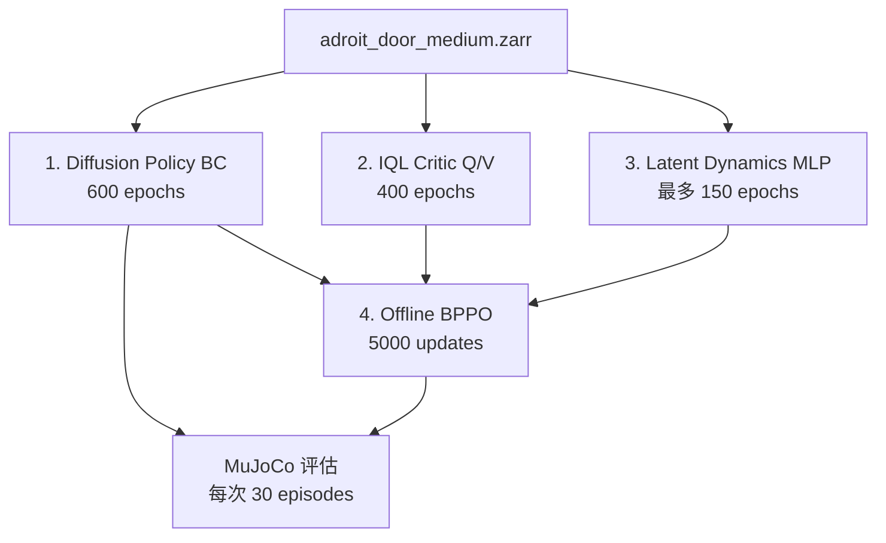

# RL-100 项目代码、任务与机器人本体理解（2026-07-14）

## 1. 当前运行命令

```bash
bash scripts/Diffusion/Offline/3D/train_policy.sh \
  rl100 adroit_door_medium 0112 100
```

四个位置参数含义：

| 参数 | 脚本变量 | 含义 |
|---|---|---|
| `rl100` | `alg_name` | 算法/实验标签，不直接选择配置文件 |
| `adroit_door_medium` | `task_name` | Hydra task 配置名 |
| `0112` | `addition_info` | 实验附加标签 |
| `100` | `seed` | 随机种子，不是 epoch 数 |

脚本将实验名拼成：

```text
adroit_door_medium-rl100-0112
```

主配置被硬编码为：

```text
rl100_3d_epsilon.yaml
```

## 2. 脚本实际运行的超参数组合

脚本包含三层循环：

```text
bppo_lr:        1e-6, 2e-6, 1e-5
rollout_length: 3, 10, 5, 15, 20
clip_std_max:   0.1, 0.8
```

因此会顺序启动：

```text
3 × 5 × 2 = 30 个独立 Python 进程
```

当前问题是这些组合共用同一个 `hydra.run.dir`，并且设置 `training.resume=True`。不同组合可能加载或覆盖前一个组合的 checkpoint、critic 和 dynamics，不是严格独立的超参数对比。后续应把三个循环参数写入输出目录或 run name。

## 3. 训练阶段和数据流

一次 `python train.py` 内部按以下顺序执行：



### 3.1 Diffusion Policy / BC

学习：

```text
observation -> dataset action
```

当前 observation：

```text
point_cloud
agent_pos
```

策略使用 diffusion 去噪过程生成动作，而不是单次 MLP 回归。

### 3.2 Critic

当前使用 IQL 风格的：

```text
Q(s, a): 执行动作后的未来累计奖励
V(s): 当前状态的期望价值
A(s, a) = Q(s, a) - V(s)
```

Critic 使用离线数据中的：

```text
obs, action, reward, next_obs, done, return
```

它负责判断数据集动作和策略动作的长期质量，为 Offline BPPO 提供 advantage。

### 3.3 Dynamics

脚本设置：

```text
dynamics_type=mlp
predict_r=False
```

主要学习：

```text
当前 latent observation + action -> 下一 latent observation
```

它不是直接预测 RGB/点云，而是在策略编码器的 latent feature 空间预测下一状态。训练最多 150 epochs，并带验证集 early stopping。

### 3.4 Offline BPPO

从 BC policy 初始化，综合：

```text
BC policy
Critic 的 Q/V 与 advantage
Dynamics 的短期状态预测
```

完成 5000 次策略更新。PPO clip 用来限制策略不要偏离离线数据分布过远。

### 3.5 评估

评估会穿插在 BC 和 BPPO 中。BC 配置 `rollout_every=50`，但初始 epoch 为 0，所以第一次训练约一个 epoch 后就会评估：

```text
0 % 50 == 0
```

每次评估 30 个 MuJoCo episodes。

## 4. `test_mean_score` 的含义

它不是平均 reward，而是严格成功率：

```text
test_mean_score = hard_success / eval_episodes
```

Door 环境在：

```text
door_pos > 1.4
```

时认为当前 step 达到目标。一个 episode 中累计达到目标的 step 数必须大于 25，才算 hard success。

30 episodes 下分数通常按以下粒度变化：

```text
0, 0.0333, 0.0667, 0.1, ...
```

训练初期 `test_mean_score=0` 很正常。应同时关注：

```text
train_loss
train_action_mse_error
mean_returns
mean_n_goal_achieved
```

## 5. 当前任务的数据集

配置文件：

```text
RL-100/rl_100/config/task/adroit_door_medium.yaml
```

数据集：

```text
data/adroit_door_medium.zarr
```

已验证样本规模和形状：

| 字段 | 形状 |
|---|---|
| `state` | `(20000, 24)` |
| `action` | `(20000, 28)` |
| `point_cloud` | `(20000, 512, 6)` |
| `img` | `(20000, 84, 84, 3)` |
| `reward` | `(20000, 1)` |
| `done` | `(20000, 1)` |
| `return` | `(20000, 1)` |

点云的 6 维为位置和颜色。当前策略配置 `use_pc_color=False`，主要使用 XYZ。

## 6. 当前机器人本体：Adroit 灵巧手

`adroit_door_medium` 不是普通六轴机械臂任务，也不是双臂任务。它使用：

```text
单只 Adroit 五指灵巧手
+ 可移动/旋转手腕
+ 门、把手和门轴 MuJoCo 模型
```

任务配置接口：

```text
agent_pos: 24
action: 28
point_cloud: 512 × 3
```

调用链：

```text
adroit_door_medium.yaml
  -> AdroitRunner
  -> AdroitEnv("door")
  -> GymEnv("door-v0")
  -> mj_envs Adroit Door XML/Python 环境
```

关键本体文件：

```text
third_party/rrl-dependencies/mj_envs/
  mj_envs/hand_manipulation_suite/assets/DAPG_door.xml
  dependencies/Adroit/Adroit_hand.xml
  mj_envs/hand_manipulation_suite/door_v0.py
```

策略行为大致是：

```text
移动手腕接近把手
-> 多指抓住把手
-> 转动/拨动把手
-> 拉开门并保持
```

因此当前 Adroit checkpoint 不能直接控制 Piper 双臂。

## 7. 仓库中的单臂任务参考

### 7.1 MetaWorld 单臂仿真

RL-100 提供大量 MetaWorld Sawyer 单臂任务：

```text
pick-place
drawer-open / drawer-close
door-open / door-close
button-press
faucet-open / faucet-close
assembly
peg-insert-side
```

典型动作空间：

```text
action: 4 = dx, dy, dz, gripper
agent_pos: 9
```

这是普通机械臂加二指夹爪最值得参考的仿真训练链路。

### 7.2 Franka + LEAP Hand 真机

相关任务：

```text
rotate
rotate_512_arm
rotate_1024_arm
pour
pour_1024
```

可参考：

- RealSense 采集线程。
- 真机 `reset()/step()`。
- TCP 动作与手部动作拼接。
- 安全限幅和控制周期。

但末端是 LEAP 灵巧手，不是二指夹爪。

### 7.3 UR5

仓库有 UR5、RTDE 和 RealSense 代码，但部分 runner 中 import 被注释，当前不是开箱即用。可以参考控制器结构，不建议作为 Piper 主模板。

## 8. 仓库中的双臂参考

### 8.1 Flipping 双臂真机任务

主要文件：

```text
rl_100/config/task/flipping.yaml
rl_100/env_runner/flipping_runner.py
rl_100/env/flipping/flipping_env.py
rl_100/dataset/flipping_dataset.py
```

接口接近：

```text
agent_pos: 14
action: 14
```

这与 Piper 双臂可采用的定义非常接近：

```text
左臂 6D TCP + 左夹爪 1D
右臂 6D TCP + 右夹爪 1D
= 14D action
```

它还包含 ZMQ 机器人服务、RealSense、Gello/遥操作和人工成功判断。但目前存在：

- 写死的 IP/端口和本机路径。
- 旧 xArm/Franka 注释残留。
- 配置与环境状态维度不完全一致。
- critic dataset 指向 `push_t.zarr` 等遗留配置。
- 依赖人工键盘判断 reward。

它适合当双臂代码骨架，不是直接可运行的 Piper 实现。

### 8.2 ManiSkill 双臂仿真

`third_party/pointcloud_rl` 中有：

```text
mobile_a2_dual_arm.yml
push_chair.yml
move_bucket.yml
```

它使用左右 Panda 臂，可参考双臂关节、夹爪、碰撞和控制范围建模。但它尚未直接接入当前 RL-100 主训练入口。

### 8.3 Folding 配置

`folding.yaml` 的维度像双臂：

```text
agent_pos: 16
action: 14
```

但 runner 和 critic dataset 仍残留 PushT 配置，完成度不足，不建议作为 Piper 主参考。

## 9. Piper 双臂适配建议

推荐组合参考：

```text
Flipping     -> 双臂 state/action、真机 runner、数据集结构
MetaWorld    -> 末端增量控制和完整仿真训练流程
Franka       -> RealSense、真机控制、安全限制
ManiSkill    -> 双臂仿真本体、关节和碰撞配置
```

建议新增而不是直接修改 Adroit：

```text
rl_100/env/piper/piper_dual_arm_env.py
rl_100/env_runner/piper_dual_arm_runner.py
rl_100/dataset/piper_dual_arm_dataset.py
rl_100/config/task/piper_dual_arm_<task>.yaml
```

首先冻结 observation/action contract。推荐候选：

```text
action: 14
  = 左臂 6D TCP delta + 左夹爪
  + 右臂 6D TCP delta + 右夹爪

agent_pos: 14 或 26
  = 双臂关节角 + 双夹爪
  [+ 双臂末端位姿]
```

必须适配：

- Piper SDK/CAN 控制。
- 双臂时间同步。
- 关节、速度、TCP 位移和旋转限幅。
- 双臂和环境碰撞保护。
- RGB-D 相机与双臂公共 base 标定。
- 点云裁剪、桌面过滤和 512 点下采样。
- 遥操作数据采集。
- zarr 数据转换。
- 自动 reward/success 判断。
- 安全 reset 和急停。

## 10. 当前配置中的重要注意点

### 10.1 `only_bc=True`

该选项不会让程序在 BC 后退出，只会额外保存 BC policy。因为同时设置：

```text
offline=True
```

程序仍会继续执行 Critic、Dynamics 和 Offline BPPO。

### 10.2 `distill_phase` 拼写

脚本当前是：

```bash
distill_phase='after_offlin'
```

代码识别的是：

```text
after_offline
```

因此 offline 后蒸馏目前不会触发。

### 10.3 checkpoint 与首次评估

首次评估发生在 epoch 0，而 checkpoint 保存也按 epoch 周期执行。若首次评估在保存前崩溃，则前一个 epoch 的训练进度不会留下有效 checkpoint。

## 11. 今日完成的项目代码修改

- 训练脚本加入 legacy MuJoCo native library 环境变量。
- `rl_100.env` 改为按需延迟导入，隔离非当前机器人依赖。
- vendored Stable-Baselines3 vec env 改用本地相对导入，避免与 SB3 2.9 混用。
- 环境版本调整后完成 Adroit 图像、深度、点云和 FPS 的完整回归。

